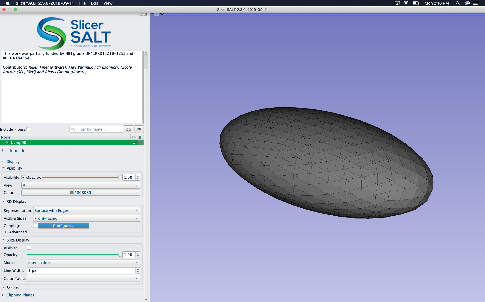

Covariate Significance Testing

User Tutorial

Mahmoud Mostapha\, Jared Vicory\, Chao Huang\, Martin Styner\, Beatriz Paniagua 

July 2020

Covariate Significance Testing    Description

* This module provides the following functions:
  * Model Fitting & Hypothesis Testing
  * Visualize Statistical Results
* _Important note:_  __ If you are downloading this module as part of the Slicer Extension mechanism \(slides 7\-9\) then it will be named multivariate functional shape data analysis \(MFSDA\)__

Description of Covariate Significance Testing

 __Covariate Significance Testing __   provides an interface for MFSDA \(Multivariate Functional Shape Data Analysis\) method\, which is a Python based tool for statistical shape analysis\. 

A multivariate varying coefficient model is introduced to build the association between the multivariate shape measurements and demographic information and other clinical variables\. 

Statistical inference\, i\.e\.\, hypothesis testing\, is also included in this tool\, which can be used in investigating whether some covariates of interest are significantly associated with the shape information\. The hypothesis testing results are further used in clustering based analysis\, i\.e\.\, significant suregion detection\.

Description of Covariate Significance Testing

The Covariate Significance Testing tool has of the following structure: 

A VTK file providing a shape template for visualizing p\-values

A single CSV file containing the location of the surface meshes and the corresponding covariates to be tested

A VTK file providing a common coordinates for input surfaces

 _Inputs: Surface Meshes \+ Covariate Matrix \+ Spherical Template \+ Shape Template _ 

 __Covariate Significance Testing __   uses MFSDA\_run & MFSDA\_createShapes CLIs

 _Output: Fitted Model Parameters \+ P\-Values \+ Shape Template Mesh with Scalars_ 

A JSON file containing the parameters of the fitted statistical model

A JSON file containing the resultant p\-values

A VTK file of the input shape template with fitted model parameters and p\-values as point data scalars for visualization

Installation of Covariate Significance Testing Tool

Covariate Significance Testing tool can be used with  __SlicerSALT__  platform as a  _module_ \, which is the dissemination vehicle of powerful shape analysis methodology\. This software is a light\-weight\, customized version of 3D Slicer\.

Covariate Significance Testing Installation on SlicerSALT

Download the SlicerSALT packages for your respective operating system from the    _[SlicerSALT website](http://salt.slicer.org/)_    and install it\. Covariate Significance Testing will be ready to use as a module\.

Powered by Girder

MFSDA Installation on 3D Slicer

  Download 3D Slicer packages for your respective operating system on the   _[3D Slicer website](https://www.slicer.org/)_   and install it\.

MFSDA Installation on 3D Slicer

  In 3D Slicer\, open the Extension Manager

MFSDA Installation on 3D Slicer

  In the    _Install Extension_    tab\, select    _MFSDA_    under    _Categories_ 

 Under    __MFSDA__   \, select the    _Install_    button and restart Slicer when prompted   

Covariate Significance Testing Module 

In SlicerSALT\, select    _Covariate Significance Testing Module _   \(in Slicer\, select    __MFSDA__   \) from the    _Modules_    drop\-down menu \(   _Category:_    Shape Analysis\) or on the Search bar 

Setting up Input Files

For    _Input CSV File_    _\,_    _ _   select the csv file which contains the location of input surface meshes \(\*\.vtk\) and corresponding covariates

First column contains the location of input surface vtk files 

Each additional column represent a covariate to be tested\, which can be categorical or continuous

Example of an input CSV file with one categorical covariate

Input Surface Meshes Visualization

Shape Population Viewer can be used to check the input surface meshes\, where the same CSV file as its input

Input Surface Meshes Visualization

Setting up Input Files

For    _Input Spherical Template_    _\,_    _ _   select the vtk file which provides a common coordinates for the of input surface meshes

Example of an input spherical template file\, which can be an average surface or one of the input surfaces

Setting up Input Files

For    _Input Shape for p\-values_    _\,_    _ _   select the vtk file which will be used to visualize the fitted model parameters and the resulted p\-values

Example of an input shape for p\-values file\, which can be an average surface or one of the input surfaces

Setting up Output Directory

For    _Output Files Directory_    _\,_    _ _   select the folder where the module will store the output files

Running Covariate Significance Testing Module 

Click on the    _Run_    _ _   button\, to run the MFSDA\_run & MFSDA\_createShapes CLIs on the provided inputs files

 _SlicerSALT Error Log_    can also be used for debugging if the module was completed with errors\. 

 _SlicerSALT Error Log_    can also be used for debugging if the module was completed with errors\. 

The outputs files for the Covariate Significance Testing Module  are stored in the output folder specified by the user: 

Fitted model parameters

Shape template with Scalars

Hypothesis testing p\-values

The output files generated by running Covariate Significance Testing 

Output Shape Template Visualization

Shape Population Viewer can be used also to visualize the output shape template with fitted model parameters and p\-values as scalars

Acknowledgements \- Resources \- Questions

* The MFSDA developers gratefully acknowledge funding for this project provided by NIH NIBIB R01EB021391 \(Shape Analysis Toolbox for Medical Image Computing Projects\)\, as well as the Slicer community\.
* Github repository:
      * _[MFSDA](https://github.com/DCBIA-OrthoLab/MFSDA_Python)_  _ _
      * _[SlicerSALT](https://github.com/Kitware/SlicerSALT)_
      * _[3D Slicer](https://github.com/Slicer/Slicer)_
* Forums:
      * _[SlicerSALT](https://discourse.slicer.org/t/about-the-slicersalt-category/47)_
      * _[3D Slicer](https://discourse.slicer.org/)_
* For other remarks or questions\, please email:
* beatriz\.paniagua@kitware\.com

