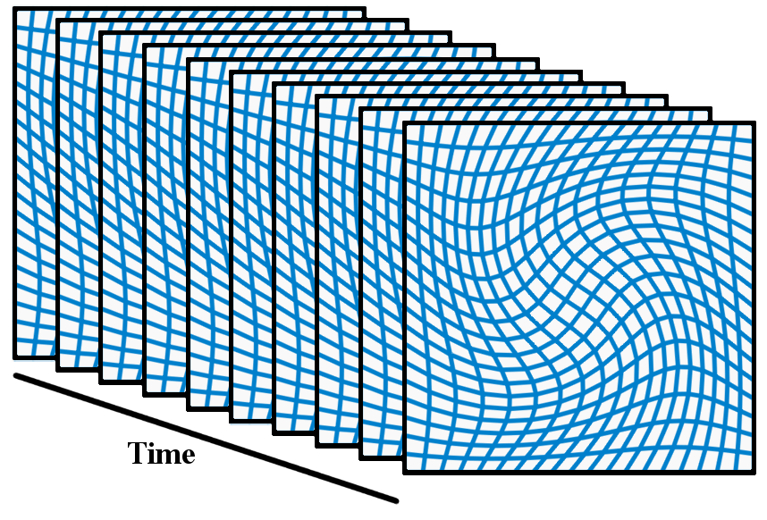
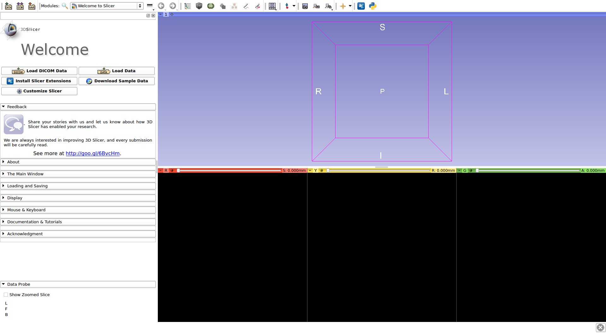

Shape Regression

User Tutorial

James Fishbaugh\, Guido Gerig\, Laura Pascal\, Jared Vicory\, Beatriz Paniagua

January 2019

Table of Contents

 __1\) __   Description of Shape Regression…………\.\.…\.3

 __2\)__    Installing the Software…………………………\.\.8

 __3\)__    Shape Regression Workflow………………\.…13

 __4\) __   Debugging and Quality Control………………\.46

 __5\)__    Acknowledgments and Resources…………\.\.\.51

Description of Shape Regression

Description of Shape Regression

Shape regression consists of estimating a continuous shape sequence which best matches a set of observed shapes 

 __What growth model?__    Model anatomical evolution by a continuous deformation of space

Acceleration Controlled Shape Regression

 __How to parameterize deformations?__ 

 __Key Idea: __   Parameterize a flow of deformations by    __acceleration__    vectors\, which produce velocity\, which in turn results in a change of position\.

Acceleration Controlled Shape Regression

We define the acceleration field a\(x\(t\)\)

the shape points carrying a point force vector α  i

kernel with standard deviation λ  V

Time varying deformation 

 initial position

 initial velocity

Impact of Parameters

 __Size of deformation kernel:__    T  he  distance  at  which  neighboring  points  move  in  correlation\. Higher values result in mostly rigid deformation\, while lower values allow points a greater degree of independent movement\. 

 __Size of shape matching kernel:__    T  he scale at which shape differences are considered noise\.  For matching very detailed shape features\, choose a small value\.  For noisy observations with spurious features\, set this value larger than the size of the features\.

 __Regularity weight:__       A low weight on regularity results in models which closely match observed data\, tending towards interpolation \(rather than regression\) the weight goes to zero\.

See    __“Model selection for spatiotemporal modeling of early childhood sub\-cortical development” SPIE Medical Imaging \(2019\)__    for more detail

Installing the Software

Installation of ShapeRegression Module in SlicerSALT

Download the SlicerSALT packages for your respective operating system from the   _[SlicerSALT website](http://salt.slicer.org/)_   and install it\. 

Powered by Girder

Installation of ShapeRegression Module in SlicerSALT

  Download 3D Slicer packages for your respective operating system on the   _[3D Slicer website](https://www.slicer.org/)_   and install it\.

Installation of ShapeRegression Module In 3D Slicer

  In 3D Slicer\, open the Extension Manager

Installation of ShapeRegression Module In 3D Slicer

 In the    _Install Extension_    tab\, select    _Shape Regression_    under    _Categories_ 

 Under    __ShapeRegressionExtension__   \, select the    _Install_    button and restart Slicer when prompted   

Shape Regression Workflow

1\)    __Regression Computation__    – Model estimation

2\)    __Regression Visualization__    – Visualization of estimated shape change

Shape Regression Model Estimation

Begin by selecting ‘   __Regression Computation__   ’

Downloading   tutorial sample data

Download tutorial   sample data 

to a directory of your choice

Setting up Input Data

Click the button to select the directory with input vtk shapes

Setting up Input Data

Navigate to the directory containing the tutorial shapes

Setting Parameters

 _Time point_    automatically populated if shape names have time\-suffix

Setting Parameters

 _Kernel width_    initialized as 50% of the smallest extent of the shape

Setting Parameters

 _Shape index_    indicates shape correspondence in multi\-objects

Setting Parameters

Weight controls the importance of each shape in model estimation

Setting Parameters

Leave all settings at default and expand    _‘Time Parameters’_ 

Setting Parameters

Time point range is set using the min and max from input shapes

Setting Parameters

Leave all settings at default and expand    _‘Deformation Parameters’_ 

Setting Parameters

The width of the deformation kernel\. Lower values result in more non\-linear changes\, higher values tend towards rigid deformation\.

Setting Parameters

For shape inputs with only a few hundred vertices\, chose ‘exact’\, otherwise ‘p3m’ usualy results in faster model estimation\.

Setting Parameters

Balances data\-matching and regularity\. Lower values favor accurate data\-matching\.

Setting Parameters

Leave all settings at default and expand    _‘Output Parameters’_ 

Setting Parameters

Click to choose an output directory for the estimated model

Setting Parameters

Create a new folder called ‘output’

Setting Parameters

Leave all settings at default and expand    _‘Optional Parameters’_ 

Setting Parameters

Change the maximum number of iterations to ‘200’

Model Estimation

Model Estimation

Click ‘Run Shape4D’

Model Estimation

Estimation may take several minutes to finish

Model Estimation

Estimation has converged when    _‘Status: Completed’_    is displayed

Visualizing Shape Regression Results

We can now visualize the model by selecting ‘   __RegressionVisualization’__ 

Visualizing Shape Regression Results

Click to choose the directory containing the estimated model

Visualizing Shape Regression Results

Choose the output directory from ‘   __Regression Computation__   ’

Visualizing Shape Regression Results

The rootname is automatically populated if a final model is found in the directory\. Otherwise rootname has to be specified\.

Visualizing Shape Regression Results

Click ‘   _Create Sequence_   ’ button to load the model sequence

Visualizing Shape Regression Results

Hold right mouse button to zoom\. Hold left button to rotate\.

Visualizing Shape Regression Results

Expand ‘   _Sequence Visualization Options’_ 

Visualizing Shape Regression Results

Change the color map to    _‘velocity’ _   to visualize speed of shape change

Visualizing Shape Regression Results

The    _‘Sequence Browser’_    section allows for playback of the model

Visualizing Shape Regression Results

Expand ‘Regression Volume Plot’ and click the plot button

Visualizing Shape Regression Results

A volume plot shows the estimated volume from shape regression along with the volume of the original shape observations

Shape Regression Debugging and Quality Control

If an error occurred\, you will be 

presented with a notification

Error details may be viewed in the    __Error Log __   under    _View_ 

* If RegressionComputation experiences an error\, carefully check parameter settings\, including:
  * Input shapes 'Time Point' \- make sure all time points are within the 'Time point range'
  * Check the input \.vtk shapes exist at the path selected and verify all \.vtk files are valid
  * In some cases\, it may be necessary to reorient the surface normals of input shapes before model estimation
* Use the RegressionVisualization module to view the estimated shape trajectory as an animation
  * It is helpful to load the original observations displayed with transparency to visually assess model fit

* Use the RegressionVisualization module to view the volume measured after shape regression
  * The volume plot can help to assess model fit and inform about possible overfitting

Acknowledgements \- Resources \- Questions

* The ShapeRegressionExtension developers gratefully acknowledge funding for this project provided by NIH NIBIB R01EB021391 \(Shape Analysis Toolbox for Medical Image Computing Projects\)\, as well as the Slicer community\.
* Github repository: 
      * _[ShapeRegression](https://github.com/KitwareMedical/ShapeRegressionExtension)_   _ _ 
      * _[SlicerSALT](https://github.com/Kitware/SlicerSALT)_
      * _[3D Slicer](https://github.com/Slicer/Slicer)_
* Forums:
      * _[SlicerSALT](https://discourse.slicer.org/t/about-the-slicersalt-category/47)_
      * _[3D Slicer](https://discourse.slicer.org/)_   
* Papers: 
      * _[Estimation of Smooth Growth Trajectories with Controlled Accelerationo from Time Series Shape Data](https://www.ncbi.nlm.nih.gov/pubmed/21995054)_
      * _[Model Selection for Spatiotemporal Modeling of Early Childhood Sub\-cortical Development](http://research.engineering.nyu.edu/~fishbaugh/docs/fishbaugh_spie_2019.pdf)_
* For other remarks or questions\, please email: 
* james\.fishbaugh@  kitware\.com

