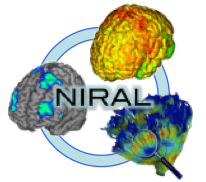
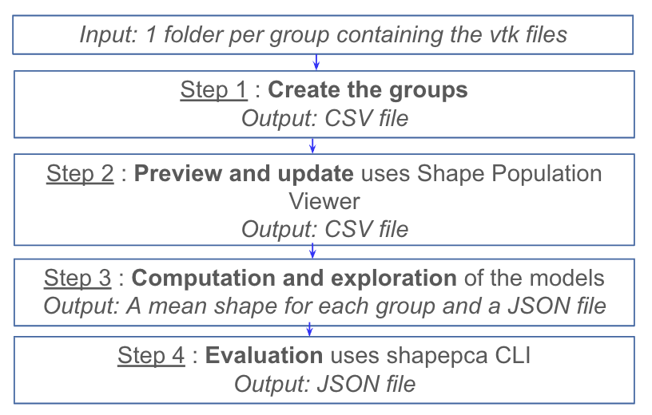
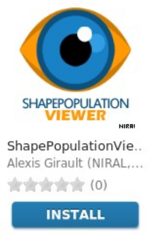
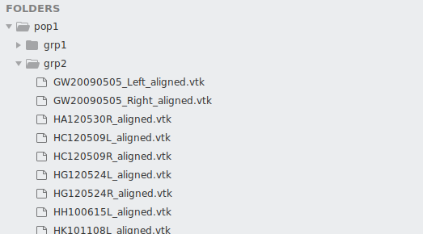
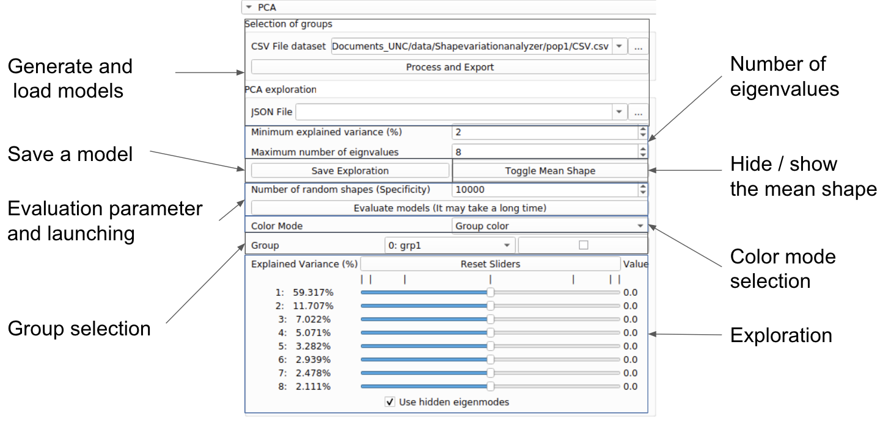
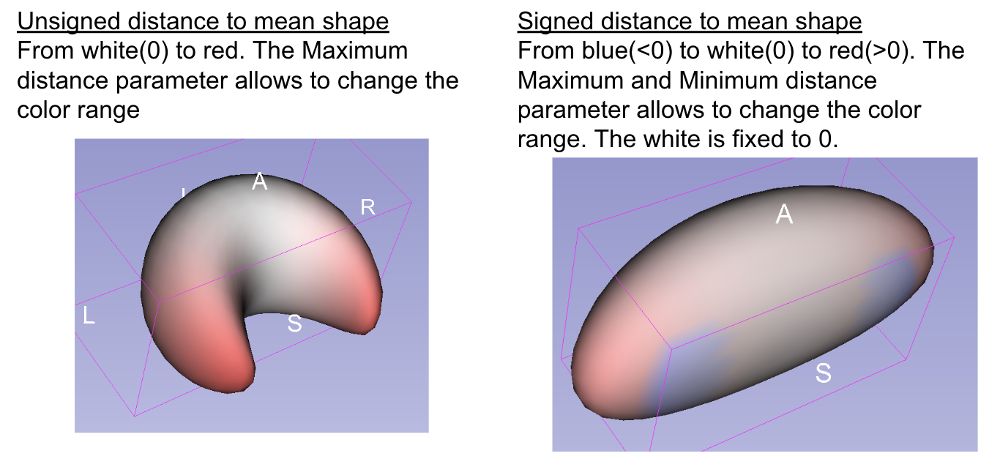

Shape Variation Analyzer

User Tutorial

Mateo lopez\, Priscille de Dumast\, Juan C\. Prieto\, Martin Styner\, Beatriz Paniagua 

December 2019

ShapeVariationAnalyzer Tool Description

Step 1: Create the different groups

Step 2: Preview and group update  

Step 3: Generate and explore models

Step 4: Evaluate the models

Description of ShapeVariationAnalyzer

 __Shape Variation Analyzer \(SVA\)__    allows the computation of PCA decomposition of groups of shapes in order be able to represent them in a lower dimensional space\.    __SVA__    also allows the user to explore the generated PCA space and to evaluate the quality of the generated models\.

The inputs meshes are vtk files\, they must have corresponding points to be processed by SVA\. If it is not the case\, SlicerSALT provides tools that are able to convert the data set\.

Description of ShapeVariationAnalyzer

The SVA tool consists on four steps: 

 _Input: 1 folder per group containing the vtk files_ 

 _Step 1_    :    __Create the groups__    

 _Output: CSV file _ 

 _Step 2_    :    __Preview and update__    uses Shape Population Viewer

 _Output: CSV file _ 

 _Step 3_    :    __Computation and exploration__    of the models

 _Output: A mean shape for each group and a JSON file _ 

 _Step 4_    :    __Evaluation__    uses shapepca CLI

 _Output: JSON file _ 

Step 1: Create the groups

 _Input_   : Folders containing files  

This step will generate a CSV file describing the location of each shape and their corresponding group\. To do so a folder per group should be created\. 

 _Output_   : CSV file

 __Figure__   : Input/Output for the creation of groups

Step 2: Preview and Update

This step will allow the user to visualize the groups in Shape Population Viewer\. 

He will be able modify groups before computation\, if it is necessary\.

Step 3: Generate and Explore Models 

Generating the PCA representation will:

Compute the explained variance ratio and the cumulative sum of the explained variance ratio

Project each group on the two first component

Compute a mean shape for each group\.

Step 3: Generate and Explore Models 

The exploration of the models will allows to:	

Generate new shapes with sliders representing each component of the PCA model

Visualize the distance of the current shape compared to the mean shape of the group\.

visualize a particular member of a group\, or the mean shape of a sub\-group

Individual population shape

Step 4: Evaluate the models  

This   _ _   step will evaluate the models by computing three values:

_Model compactness:_  __ __

__A compact model is one that has as little variance as__

__possible and requires as few parameters as possible to define an instance\. __

_Model generalization: _

__The generalization ability of a model measures its__

__capability to represent unseen instances of the object class\. This is a fundamental__

__property as it allows a model to learn the characteristics of an object class__

__from a limited training set\. __

_Model specificity: _

__A specific model should only generate instances of the__

__object class that are similar to those in the training set\. It is useful to assess__

__this qualitatively by generating a population of instances using the model and__

__comparing them to the members of the training set\. __

Installation of SVA Tool

* SVA tool can be used with two open\-source software platforms: 
      *  __SlicerSALT__   : which is the dissemination vehicle of powerful shape analysis methodology\. This software is a light\-weight\, customized version of 3D Slicer\. It contains SVA    _as a module_   \. 
      *  __3D Slicer__   : which is an open\-source and free software platform for medical image informatics\, image processing\, and three\-dimensional visualization\. SVA can be downloaded    _as an extension_   \.  

SVA Installation on SlicerSALT

Download the SlicerSALT packages for your respective operating system from the   _[SlicerSALT website](https://salt.slicer.org/)_   and install it\. SVA will be ready to use then\. 

Powered by Girder

SVA Installation on 3D Slicer

  Download 3D Slicer packages for your respective operating system on the   _[3D Slicer website](https://www.slicer.org/)_   and install it\.

SVA Installation on 3D Slicer

  In 3D Slicer\, open the Extension Manager

SVA Installation on 3D Slicer

  In the    _Install Extension_    tab\, select    _ShapeVariationAnalyzer_    under    _Categories_ 

 Under    __ShapeVariationAnalyzer__   \, select the    _Install_    button and restart Slicer when prompted \!\!\!\!\!\!\!\!\!  

SVA Installation on 3D Slicer

To visualize groups before the computation\,SVA uses    __Shape Population Viewer__    extension\. Shape Population Viewer can be installed as a 3D Slicer extension or as an external binary\. This module is included as part of the SlicerSALT package\.  

SVA Installation on 3D Slicer

* To install    __Shape Population Viewer__    as    _a 3D Slicer extension_   : 
    * Open    _Extension Manager_   \, in the    _Install Extensions _   tab\, select ‘   _Shape Analysis’_    under    _Categories_ 
    *  Select the appropriate    _Install _   button and restart 3D Slicer when prompted

SVA Installation on 3D Slicer

* To install    __Shape Population Viewer__    as an    _external binary_   : 
    *  Download ShapePopulationViewer package for your respective operating system on    _NITRC website_ 
    *  In 3D Slicer\, open    _Application Settings _   in the    _Edit _   Menu\.  On the tab    _Modules_   \,    __Add __   the folder where  ShapePopulationViewer is stored
    *  Restart 3D Slicer

ShapeVariationAnalyzer

In 3D Slicer or in SlicerSALT\, select    _ShapeVariationAnalyzer_    from the    _Modules_    drop\-down menu \(   _Category:_    Decomposition\) or on the Search bar\.  

Setting up the input directories

* The SVA tool process PCA models for different groups at the same time
*  and a general model that combine all the groups\. To do so\, the input files should be 
* organized in folders\, one folder per group\. 
* Remember:
  * Every file must have corresponding points
  * Only \.vtk files are supported

Create the Groups

 __Tab: Creation of CSV file__    

To add a group\, select the desired folder and click the ‘Add Group’ Button to add it\. Note that adding a group will  give it a group  number

 _/data_   /population/group1

Edit a group folder

 __Tab: Creation of CSV file __ 

To edit a group\, select the desired group number in the spin box\, two new options appears:

    * Remove group: remove the current group from the list of groups
    * Modify group: This option update the current group by associating it with the current selected folder  

 _/data_   /population/group0

Export the groups file

 __Tab: Creation of CSV file __ 

When all the groups have been created\, use the Export button to save the CSV file describing the groups\. The path of this file is automatically passed to the other tabs of the module\. 

Visualize and update Groups

 __Tab: Preview/Update Group__ 

To make sure that the groups are correctly defined\, SVA offers the possibility to visualize each element of a group using the Shape Population Viewer \(SPV\) module:

    * Select all the shapes that you want to visualize by marking the corresponding check box
    * Use the preview button to launch SPV

Visualize and update Groups

 __Tab: Preview/Update Group__ 

If a shape is identified as being part of the wrong group\, change his group number and use the Export button to update the csv file\. 

Generate and Explore

 __Tab: Exploration__ 

 1\): Generate the models

Select the desired CSV file previously generated and use the Process and Export button to generate the models and import them in the explorer\. The exploration interface will appear:

Generate and

 load models

Number of 

eigenvalues

Hide / show 

the mean shape

Evaluation parameter

and launching

Color mode 

selection

Generate and Explore

 __Tab: Exploration__ 

* 2\): Save and load a model:
* We recommend to save your models before starting the exploration by using the save button: specify a \.json file \(ex: exploration\.json\) where the exploration should be saved\. 
* The following files will be generated:
    * __The specified JSON file  __
    * __A VTK file per group representing the mean shape of the group__
    * __A PYC file necessary for pca computation__
* __To load an existing exploration\, select a previously generated json file in the ‘JSON file’ field\.__

Generate and Explore

 __Tab: Exploration__ 

3\)Exploration: Groups

	Define colors for each groups\, navigate between groups using the 	group option\.   

Generate and Explore

Tab: Exploration

3\)exploration: Eigenvalues

	To start exploring the PCA space\, use the eigenvalues sliders

	If you want to play with more sliders\, you can use the minimum explained variance and the maximum number of eigenvalues to add more sliders 

Generate and Explore

Tab: Exploration

3\)exploration: Visualization of the distance 

It is possible to visualize the distance between the current shape and the mean shape by changing the color mode in the SVA interface\, keep in mind that the distance is computed using the corresponding points of the shape\, not the closest point\. 

 _Signed distance to mean shape_ 

From blue\(\<0\) to white\(0\) to red\(>0\)\. The Maximum and Minimum distance parameter allows to change the color range\. The white is fixed to 0\.

 _Unsigned distance to mean shape_ 

From white\(0\) to red\. The Maximum distance parameter allows to change the color range

Generate and Explore

Tab: Exploration

3\)exploration: Plot Visualization and interaction

	By default\, the Explained Variance Ratio plot appears when a model is generated or loaded\. It shows\, for the selected group\, the explained variance for each eigenvalue in a bar plot\, and the cumulative sum of the explained variance\.

Generate and Explore

Tab: Exploration

3\)exploration: Plot Visualization and interaction

To see the projection of the group on the 2 first component of the PCA model\, select the 'PCA projection plot chart' plot using the top left menu of the plot area:

Use interaction mode to select point on the plot

__On this plot\, you can select a point\, the corresponding shape will be displayed by updating the sliders value\. If you select a group of points\, the mean shape of those points will be displayed\. __

Evaluate the models

Tab: Exploration

4\) Evaluation:

	To make sure that the generated models are well defined\, SVA can evaluate the models by computing the compactness\, specificity and generalization and visualize them in the plot area\.

* Parameters: 	
  * The number of eigenvalues are determined by the number of sliders available when the evaluation is launched\.
  * The number of random shapes parameter allow to choose how many shapes should be generated to compute the specificity\. 

	To launch the evaluation\, use the Evaluate models button\. The evaluation is a long process\, if you want to abort it\, you can use the same button\.

Evaluate the models

Tab: Exploration

4\) Visualize the evaluation:

	When the evaluation is done\, you can visualize the results by selecting in the plot area menu the PCA Specificity plot chart\, the PCA Compactness plot chart or the PCA Generalization plot chart\.

Acknowledgements \-

 Resources \- Questions

* The ShapeVariationAnalyzer developers gratefully acknowledge funding for this project provided by NIH NIBIB R01EB021391 \(Shape Analysis Toolbox for Medical Image Computing Projects\)\, as well as the Slicer community\.
* Github repository: 
      * _[ShapeVariationAnalyzer](https://github.com/DCBIA-OrthoLab/ShapeVariationAnalyzer)_   _ _ 
      * _[SlicerSALT](https://github.com/Kitware/SlicerSALT)_
      * _[3D Slicer](https://github.com/Slicer/Slicer)_
* Forums:
      * _[SlicerSALT](https://discourse.slicer.org/t/about-the-slicersalt-category/47)_
      * _[3D Slicer](https://discourse.slicer.org/)_   
* For other remarks or questions\, please email: 
* _[beatriz\.paniagua@kitware\.com](mailto:beatriz.paniagua@kitware.com)_
* _[Juanprietob@gmail\.com](mailto:Juanprietob@gmail.com)_

