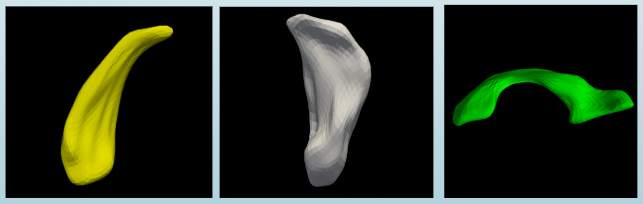
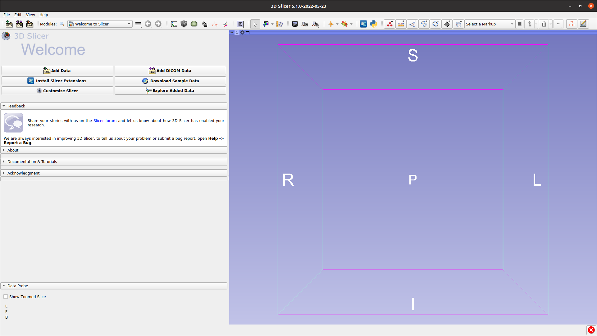

Shape analysis via skeletal models

User Tutorial

Zhiyuan Liu\, Stephen M\. Pizer\, Beatriz Paniagua\, Jared Vicory\, Junpyo Hong\, Connor Bowley

May 2022

# Introduction to skeletal representations

Skeletal representations

Shape Analysis allows studying morphology in populations of anatomic structures\. A    __skeletal representation \(s\-rep\) is__    used to model the structure of an object with no essential interior branches\, providing a rich geometric representation with correspondence across cases\. 

The S\-rep Extension \(short for    __Skeletal Representation Extension__   \) in SlicerSALT provides utilities to visualize\, initialize and refine s\-reps of 3\-dimensional objects\.

Figure: Some examples have been researched via s\-rep

Left: caudate nucleus Middle: hippocampus Right: cerebral ventricle 

The Slabular S\-rep

A 3D object whose length is notably larger than its width which is notably larger than its thickness is suitable for modeling by a slabular s\-rep\.

A slabular s\-rep \(from now on just referred to as an s\-rep\) 

consists first of a folded\, two\-sided quasi\-medial sheet inside the object\.  This sheet is called the “skeletal sheet”\. It is sampled into a network of skeletal positions\.

Special skeletal samples are at positions where the sheet folds back onto itself\.

Figure: A skeletal model for a hippocampus\.  

Left: the surface mesh of hippocampus\.

Right: the skeletal sheet of the s\-rep of this hippocampus

The Slabular S\-rep

From each sample point on the skeleton\, a vector to and approximately orthogonal to the boundary is provided as part of the s\-rep\. These vectors are called “spokes”\.

The spokes emanating from the fold curve of the sheet \(yellow curve in the right figure\) meet the  object surface at crest points\. 

The spokes can be interpolated into a finer mesh\, and the spoke endpoints can be interpolated into a implied boundary for the object\.

Figure: A skeletal model for a hippocampus\.  

	     Left: implied boundary of hippocampus\.

	     Right: the s\-rep of hippocampus

# The SlicerSkeletalRepresentations extension

Modules Overview

 __SRep:__    Visualization and interpolation of existing s\-reps

 __SRepCreator:__    Initialize an s\-rep by mean curvature flow of an object boundary

 __SRepRefinement:__    Refine an s\-rep to more closely fit an object boundary

All the s\-rep modules can be found in the category    _Skeleton\, topology_ 

S\-rep MRML Nodes

3D Slicer uses Medical Reality Modeling Language \(MRML\) nodes as the data types for its processing\. The s\-rep extension adds a new MRML data node used to describe s\-reps\.

These nodes can be saved and loaded as   \.srep\.json   files using Slicer’s built in save and load facilities\.

S\-rep modules workflow

3D Visualization

S\-rep Extension in SlicerSALT

Download the SlicerSALT packages for your respective operating system from the    _[SlicerSALT website](http://salt.slicer.org/)_    and install it\. The    _SlicerSkeletalRepresentation_    extension will be ready to use\.

Powered by Girder

S\-rep Extension Installation on 3D Slicer

Download 3D Slicer at   _[https://download\.slicer\.org/](https://download.slicer.org/)_   

S\-rep Extension Installation on 3D Slicer

From 3D Slicer\, open the extension manager

S\-rep Extension Installation on 3D Slicer

Search for “SkeletalRepresentation”\, press Install\, then press Restart in the bottom right corner\.

# SRep Module

SRep: Visualization

Can visualize the SRep \(or pieces thereof\) 

Can see basic information\, such as number of spokes

SRep: Interpolation

Can interpolate skeletal grid and spoke points

Will increase number of spokes by 2  \(Interpolation level\)   times

Both original and interpolate s\-reps displayed\. The original s\-rep was given thicker lines for visualization purposes\.

# SRepCreator Module

Create s\-reps from Models \(\.vtk\, \.stl\, \.ply\, etc\) in 2 steps

Forward Flow: creates an ellipsoid that best fits the input model and creates an SRep to fit that ellipsoid\. The model is "flowed" toward an ellipsoidal shape for a number of iterations\, then a best fit ellipsoid is made on the flowed shaped\.

Example forward flow to ellipsoid

Backward Flow: adjusts the SRep created from the ellipsoid to fit the original model by reversing the flow transformations made during the forward flow\.

Example backward flow to fit original model

SRepCreator Parameters

* S\-rep creation parameters \(also see “Help” in the module\)
  *  _Input Mesh: _   model to create the SRep of\. 
  *  _Max iterations:_    the number of iterations to run in the forward flow\. 
  *  _Step size:_    the size of step to take in during the forward flow\. 
  *  _Smooth amount:_    the amount of smoothing that should be applied to the model while flowing toward the ellipsoidal shape\. The algorithm doesn't work well with sharp edges or points\, so smoothing can help with that\. 
  *  _\# Fold Points:_    The number of fold \(aka crest\) points in the generated SRep\. 
  *  _\# Steps to Fold:_    The number of steps from the spine to outer boundary of the skeletal sheet\. The point on the spine is not included in this number\.

Running SRepCreator

Set the desired parameters and press run\. During the creation of the s\-rep you will see a progress bar\, but be unable to do anything else in Slicer\.

After a couple minutes an SRep will be created with the name   \<Model\-name>\-srep  \.

You can then use the    _Data_    or    _SRep_    modules to visualize the SRep\.

# SRepRefinement Module

The goal of refinement is to better fit an s\-rep’s spokes to the boundary of the model it was created from\. There are three factors we consider when defining the objective function for fit\.

The distance from s\-rep implied boundary \(the ends of the spokes\) to actual model boundary\.

The deviation of the spokes from being perpendicular to the model boundary\.

The geometric illegality of the spokes\, i\.e\. the spokes are not allowed to cross each other\.

SRepRefinement Parameters

 _Input Model:_    the model to refine the SRep to 

 _Input SRep:_    the SRep to be refined 

 _Output SRep:_    the SRep object to put the refined SRep into 

 _Interpolation level:_    how much to interpolate between spokes\. The interpolated spokes are used to define the implied boundary used by the objective function\. Interpolated spokes are produced at 2  level   times the original density\. 

 _Initial region size:_    the initial value of the newuoa trust region radius\. 

 _Final region size:_    the final value of the newuoa trust region radius\. Typically this is around one tenth the greatest expected change to a variable\. 

 _Max iterations:_    the maximum amount of iterations to run 

SRepRefinement Parameters

 _Image match weight:_    the amount of weight to place on the L0 penalty for not being on the model boundary

 _Normal match weight:_    the amount of weight to place on the L1 penalty for not being normal to the model boundary

 _Geometric illegality weight: _   the amount of weight to place on the L2 penalty for having illegally crossing spokes

Running SRepRefinement

Set the desired parameters and press run\. During the refinement of the s\-rep you will see a progress bar\, but be unable to do anything else in Slicer\.

After a few minutes the refined s\-rep will be available in the    _Output SRep_    node\.

You can then use the    _Data_    or    _SRep_    modules to visualize the SRep\.

Acknowledgements \-

 Resources \- Questions

* The S\-rep module developers gratefully acknowledge funding for this project provided by NIH NIBIB R01EB021391 \(Shape Analysis Toolbox for Medical Image Computing Projects\)\, as well as the Slicer community\.
* Github repository: 
      *  _[SkeletalRepresentation](https://github.com/KitwareMedical/SRepExtension)_    _ _ 
      *  _[SlicerSALT](https://github.com/Kitware/SlicerSALT)_ 
      *  _[3D Slicer](https://github.com/Slicer/Slicer)_ 
* Forums:
      *  _[SlicerSALT](https://discourse.slicer.org/t/about-the-slicersalt-category/47)_ 
      *  _[3D Slicer](https://discourse.slicer.org/)_    
* Papers & manuals: 
      * _[Fitting Unbranching Skeletal Structures to Objects](http://midag.cs.unc.edu/pubs/papers/srep_fitting_media_final_accept.pdf)_
      *  _[Object Shape Representation via Skeletal Models \(s\-reps\) and Statistical Analysis](http://midag.cs.unc.edu/pubs/papers/xavier_book_2019.pdf)_ 
      *  _[Skeletal shape correspondence through entropy](http://midag.cs.unc.edu/pubs/papers/Tu_TMI_2016.pdf)_ 
* For other remarks or questions\, please email: 
* _[beatriz\.paniagua@kitware\.com](mailto:beatriz.paniagua@kitware.com)_

