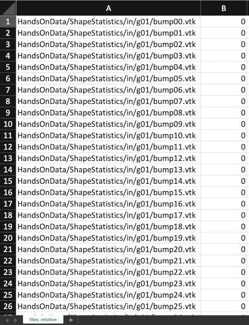
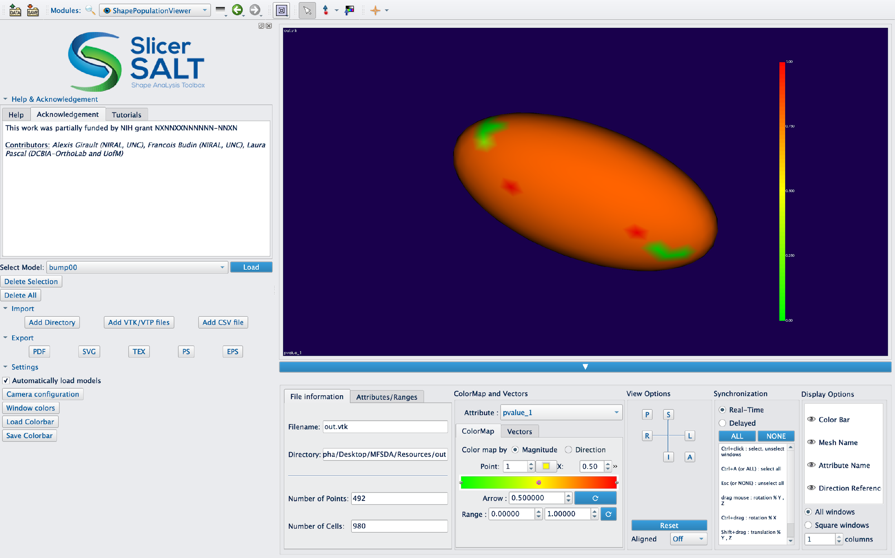

# Covariate Significance Testing User Tutorial

Authors: Mahmoud Mostapha\, Jared Vicory\, Chao Huang\, Martin Styner\, Beatriz Paniagua 

Collaborators: 

## Covariate Significance Testing Description

* This module provides the following functions:
  * Model Fitting & Hypothesis Testing
  * Visualize Statistical Results

_Important note_: If you are downloading this module as part of the Slicer Extension mechanism then it will be named multivariate functional shape data analysis \(MFSDA\)

Covariate Significance Testing    provides an interface for MFSDA \(Multivariate Functional Shape Data Analysis\) method\, which is a Python based tool for statistical shape analysis\. 
A multivariate varying coefficient model is introduced to build the association between the multivariate shape measurements and demographic information and other clinical variables\. Statistical inference\, i\.e\.\, hypothesis testing\, is also included in this tool\, which can be used in investigating whether some covariates of interest are significantly associated with the shape information\. The hypothesis testing results are further used in clustering based analysis\, i\.e\.\, significant suregion detection\.

The Covariate Significance Testing tool has of the following structure: 

## Covariate Significance Testing Installation on SlicerSALT

Download the SlicerSALT packages for your respective operating system from the   [SlicerSALT website](http://salt.slicer.org/)   and install it\. Covariate Significance Testing will be ready to use as a module\.

## MFSDA Installation on 3D Slicer

  Download 3D Slicer packages for your respective operating system on the   _[3D Slicer website](https://www.slicer.org/)_   and install it\.

  In 3D Slicer\, open the Extension Manager

  In the    _Install Extension_    tab\, select    _MFSDA_    under    _Categories_ . Under    MFSDA   \, select the    _Install_    button and restart Slicer when prompted   

## Covariate Significance Testing Module 

In SlicerSALT\, select    _Covariate Significance Testing Module _   \(in Slicer\, select    MFSDA   \) from the    _Modules_    drop\-down menu \(   _Category:_    Shape Analysis\) or on the Search bar 

### Setting up Input Files

For    _Input CSV File_    _\,_       select the csv file which contains the location of input surface meshes \(\*\.vtk\) and corresponding covariates

In the CSV file the first column contains the location of input surface vtk files and each additional column represent a covariate to be tested\, which can be categorical or continuous. Below is an example of an input CSV file with one categorical covariate.

### Input Surface Meshes Visualization

Shape Population Viewer can be used to check the input surface meshes\, where the same CSV file as its input

Setting up Input Files

For    _Input Spherical Template_    _\,_       select the vtk file which provides a common coordinates for the of input surface meshes

Below there is an example of an input spherical template file\, which can be an average surface or one of the input surfaces

### Setting up Input Files

For    _Input Shape for p\-values_    _\,_       select the vtk file which will be used to visualize the fitted model parameters and the resulted p\-values

Below there is an example of an input shape for p\-values file\, which can be an average surface or one of the input surfaces

### Setting up Output Directory

For    _Output Files Directory_    _\,_       select the folder where the module will store the output files

### Running Covariate Significance Testing Module 

Click on the    _Run_       button\, to run the MFSDA\_run & MFSDA\_createShapes CLIs on the provided inputs files

 _SlicerSALT Error Log_    can also be used for debugging if the module was completed with errors\. 

 _SlicerSALT Error Log_    can also be used for debugging if the module was completed with errors\. 

The outputs files for the Covariate Significance Testing Module  are stored in the output folder specified by the user: and they include fitted model parameters, shape template with Scalars, hypothesis testing p\-values and the output files generated by running Covariate Significance Testing 

### Output Shape Template Visualization

Shape Population Viewer can be used also to visualize the output shape template with fitted model parameters and p\-values as scalars

## Acknowledgements \- Resources \- Questions

<ul>
  <li>The MSFDA developers gratefully acknowledge funding for this project provided by NIH NIBIB R01EB021391 (Shape Analysis Toolbox for Medical Image Computing Projects), as well as the Slicer community.</li>
  <li>Github repository:</li>
      <ul>
            <li><a href="https://github.com/DCBIA-OrthoLab/MFSDA_Python">MFSDA</a></li>
            <li><a href="https://salt.slicer.org">SlicerSALT</a></li>
            <li><a href="https://github.com/Slicer/Slicer">3D Slicer</a></li>
      </ul>
  <li>Forums:</li>
      <ul>
            <li><a href="https://discourse.slicer.org/t/about-the-slicersalt-category/47">SlicerSALT</a></li>
            <li><a href="https://discourse.slicer.org/">3D Slicer</a></li>
      </ul>
  <li>For other remarks or questions, please email: beatriz.paniagua@kitware.com</li>
</ul>
