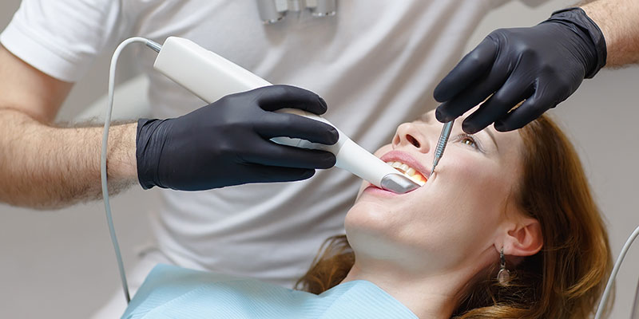
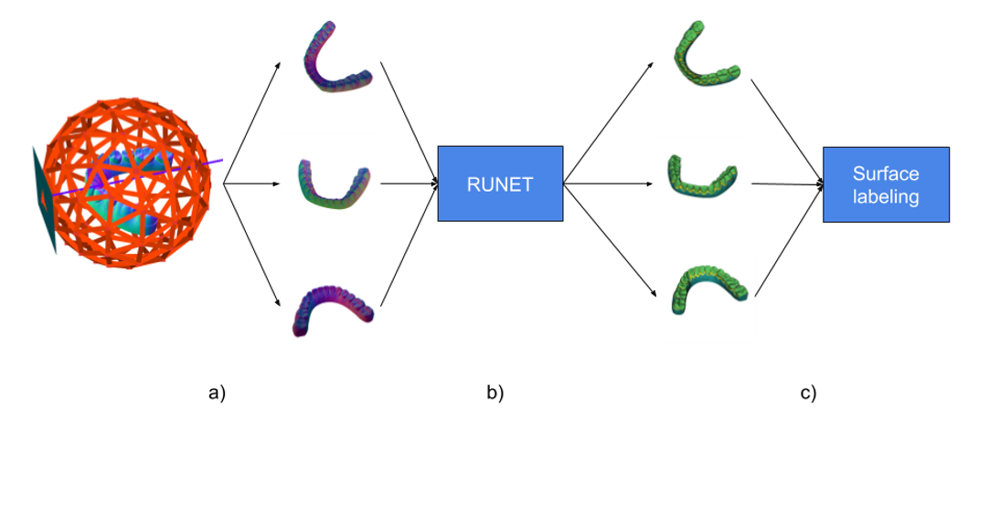
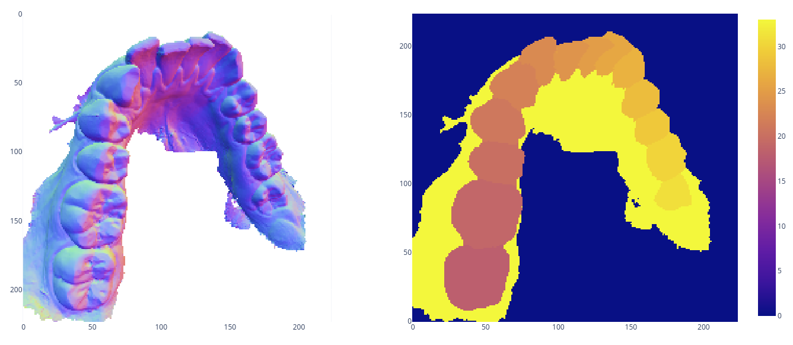
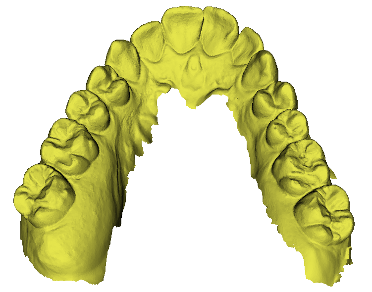
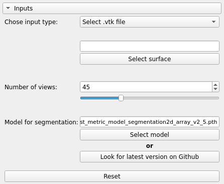
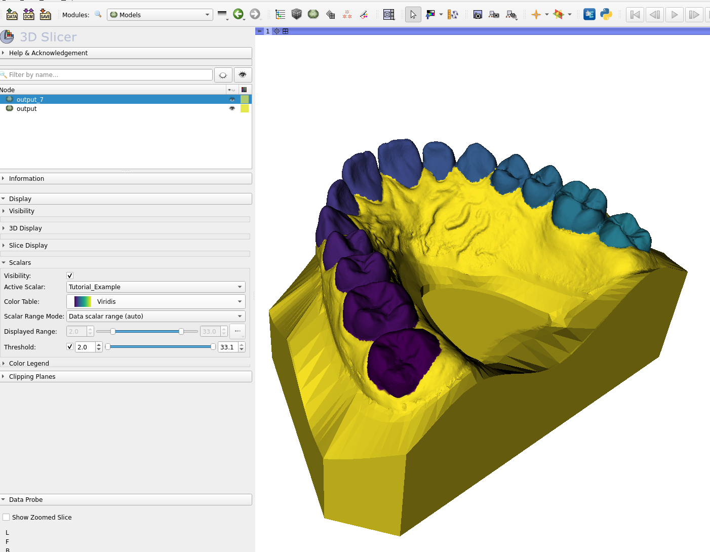

# SlicerDentalModelSeg User tutorial

Authors: Mathieu Leclercq\, Juan Carlos Prieto\, Martin Styner\, Connor Bowley\, Beatriz Paniagua 

Collaborators:

_Note:_ Intra\-Oral Scanners \(IOS - intra oral scanner\):    A device that projects light to produce a 3D model of a lower or upper jaw. Those 3D IOS scans are the inputs of our automated teeth segmentation method

## Algorithm

### Read 3D scan, apply random rotation and extract point features.

Capture 2D rendering from random viewpoints on a sphere, or viewpoints following an  icosahedron subdivision. Rendering is done with Pytorch3D.

The Pytorch3D rendering engine provides a map that relates pixels in the images to faces in the mesh and allows rapid extraction of point data (normals, curvatures, labels, etc).

Feed the 2D views to a neural network (UNET).

Put the information back into the 3D surface.

### Teeth segmentation

**Training** 

* Network: MONAI UNET \(Convolutional network used for medical image segmentation\) with residual connections\.
* Loss function: MONAI DiceCELoss\. Weighted sum of Dice and Cross\-Entropy loss\.
* Adam Optimizer\. Trained on approximately 1000 scans\. Use of the early\-stopping criteria to stop the training when the validation loss has stopped decreasing\.

## Extension Overview

The extension consists of one module \(and its associated CLI module\):

 CrownSegmentation   : GUI for dental crown segmentation\. The user has the option to use either    _[Universal Numbering System](https://en.wikipedia.org/wiki/Universal_Numbering_System)_    or    _[FDI notation](https://en.wikipedia.org/wiki/FDI_World_Dental_Federation_notation)_   \.

## SlicerJawSegmentation Installation on SlicerSALT

Download the SlicerSALT packages for your respective operating system from the   _[SlicerSALT website ](http://salt.slicer.org)_  and install it\.   The module   will be ready to use then\. 

## JawSegmentation Installation on 3D Slicer

 Download 3D Slicer packages for your respective operating system on the   _[3D Slicer website ](http://www.slicer.org)_  and install it\.

 In 3D Slicer\, open the Extension Manager

Search for    SlicerJawSegmentation    in the    _Install Extensions_    tab\.

Click    _Install_   \.

Slicer needs to    restart    after installation\.

## CrownSegmentation Module

### Inputs

*  Input type\. IOS scan\(s\)\, either:  
  *  \.vtk file\.
  * vtkMRMLModelNode of an IOS scan\.
  * Folder containing IOS scans\. 
*  Number of views:    this sets the number of 2D views used for one prediction\. A low number takes less time to compute\, but results can be inaccurate\. Generally 45 views is good\.
*  Model for segmentation:    this is the path for the neural network model\. You can look for the latest version of the network on the github repo by clicking the corresponding button\.

### Advanced

 Resolution:    This sets the resolution of the 2D views used for the prediction\.       Should stay at 320 unless the selected model explicitly works with another Resolution\.

 Name of the predicted labels:    The name of the VTK array that stores the labels for each vertex in the output surface file\.

 Install/Check dependencies   : This forces the installation of all dependencies\. You do not need to use this button as the module will automatically install all dependencies before the first prediction\.

 Create one output file for each label   : Check this box if you want one separate output file for each tooth\.

Numbering system: Choose between    _[Universal Numbering System](https://en.wikipedia.org/wiki/Universal_Numbering_System)_    and    _[FDI notation](https://en.wikipedia.org/wiki/FDI_World_Dental_Federation_notation)_   \.

### Outputs

Once prediction is over\, click    _open output surface _   to open the model in the scene\.

Go to the    _Models_    module to check the output\.

The scalar for the prediction is turned on when you click "Open output surface"\.

You can change the Color Table \(the random colors table can be useful to better distinguish close labels\)

You can enable the Threshold to hide some labels\.

## Acknowledgements \- Resources \- Questions

<ul>
  <li>The DentalModelSeg developers gratefully acknowledge funding for this project provided by NIH NIBIB R01EB021391 (Shape Analysis Toolbox for Medical Image Computing Projects), as well as the Slicer community.</li>
  <li>Github repository:</li>
      <ul>
            <li><a href="https://github.com/DCBIA-OrthoLab/SlicerDentalModelSeg.git">DentalModelSeg</a></li>
            <li><a href="https://salt.slicer.org">SlicerSALT</a></li>
            <li><a href="https://github.com/Slicer/Slicer">3D Slicer</a></li>
      </ul>
  <li>Forums:</li>
      <ul>
            <li><a href="https://discourse.slicer.org/t/about-the-slicersalt-category/47">SlicerSALT</a></li>
            <li><a href="https://discourse.slicer.org/">3D Slicer</a></li>
      </ul>
  <li>For other remarks or questions, please email: beatriz.paniagua@kitware.com</li>
</ul>

