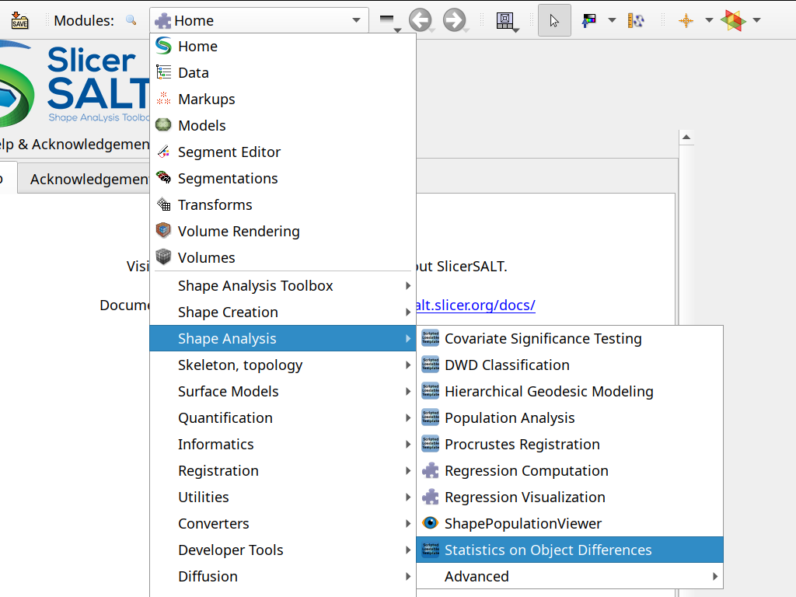
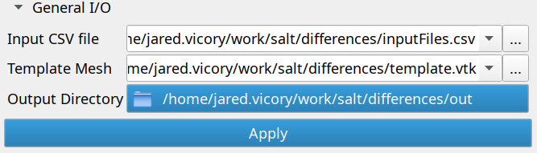
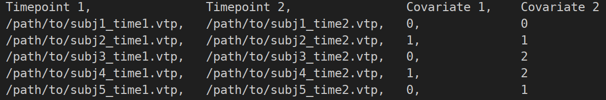
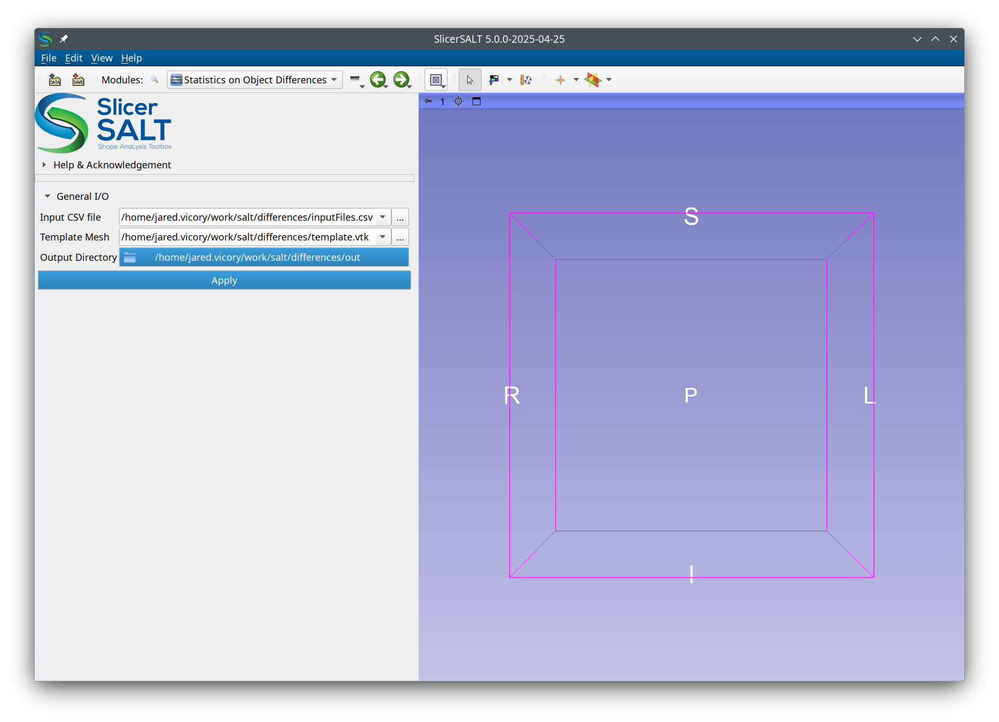
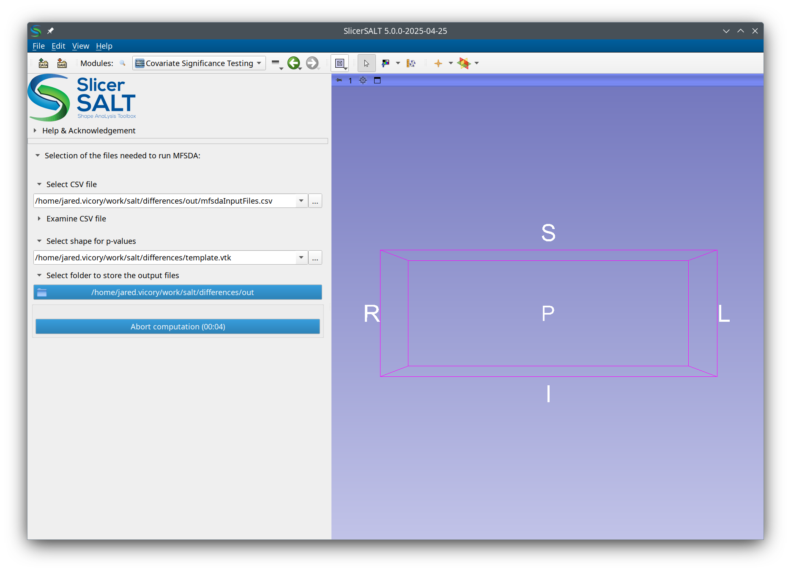
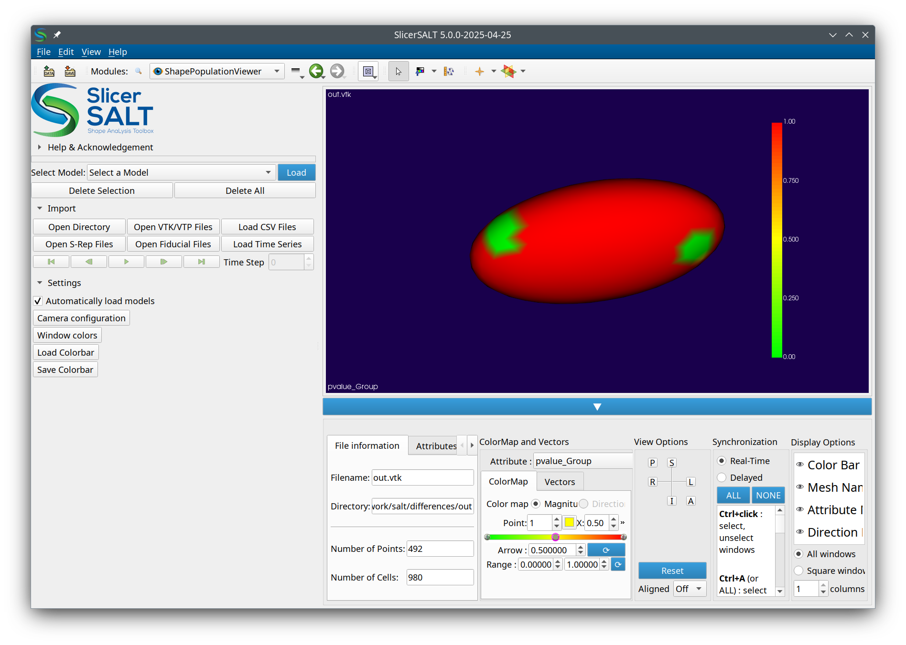

# SlicerDentalModelSeg User tutorial

Authors: Kedar Madi, Beatriz Paniagua, Jared Vicory

Collaborators:

This module allows for the computation of correlation between how shapes change between two time points and various covariates. It does this by first computing point-to-point changes between the two given timepoints, then automatically running the [Covariate Significance Testing](CovarianceTesting.md) module on the results. Computed p-values at each point on the mesh are mapped onto a given template for visualization.

## Installation on SlicerSALT

Download the SlicerSALT packages for your respective operating system from the   _[SlicerSALT website ](http://salt.slicer.org)_  and install it\.   The module   will be ready to use then\. 

## Difference Statistics Module

The module can be found in the SlicerSALT menu under `Shape Analysis` -> `Statistics on Object Differences`

### Inputs

There are three required inputs:

- Input CSV file
  - A CSV file where:
    - The first two columns, `Timepoint 1` and `Timepoint 2`, are paths to the pairs of meshes between which differences will be computed. All meshes must have the same number of points and be in correspondence (i.e., point 1 in each mesh should correspond to roughly the same anatomical location)
    - All following columns describe covariates which will be compared with the computed differences to determine if there is correlation. These covariates can be continuous or categorical.
  - An example is shown below
- Template Mesh
  - This is the mesh onto which p-values will be mapped for visualization purposes
  - This is typically a sample object from the population and should have the same number of points/correspondence as the input files (and can be one of the input files)
  - The choice of template will not effect computation
- Output Directory
  - The directory where output files will be stored. Outputs will include
    - Computed pairwise differences between timepoints
    - The various outputs from the [Covariate Significance Testing](CovarianceTesting.md) module

Example Input CSV file:

### Running the module and Outputs

Once the inputs are set, click the `Apply` button to begin computation. First, the meshes will be loaded and differences will be computed. Depending on the number of input files, this could take several minutes.

Then, SlicerSALT will switch to the [Covariate Significance Testing](CovarianceTesting.md) module, with the inputs set automatically, to begin computing correlations.

When this is finished, SlicerSALT will change to the Shape Population Viewer module which can be used to view the p-value maps for each input covariate. The data used to color the mesh can be set under `ColorMap and Vectors` -> `Attribute` on the bottom tab.

The file with the mapped p-values is saved to out.vtk in the specified output folder.

## Acknowledgements \- Resources \- Questions

<ul>
  <li>The method described here was developed by Kedar Madi during his dissertation at Wake Forest with guidance from Beatriz Paniagua. It was adapted for SlicerSALT by Jared Vicory.</li>
  <li>Github repositories:</li>
      <ul>
            <li><a href="https://github.com/slicersalt/DifferenceStatistics">DifferenceStatistics</a></li>
            <li><a href="https://salt.slicer.org">SlicerSALT</a></li>
            <li><a href="https://github.com/Slicer/Slicer">3D Slicer</a></li>
      </ul>
  <li>Forums:</li>
      <ul>
            <li><a href="https://discourse.slicer.org/t/about-the-slicersalt-category/47">SlicerSALT</a></li>
            <li><a href="https://discourse.slicer.org/">3D Slicer</a></li>
      </ul>
  <li>For other remarks or questions, please email: beatriz.paniagua@kitware.com</li>
</ul>

