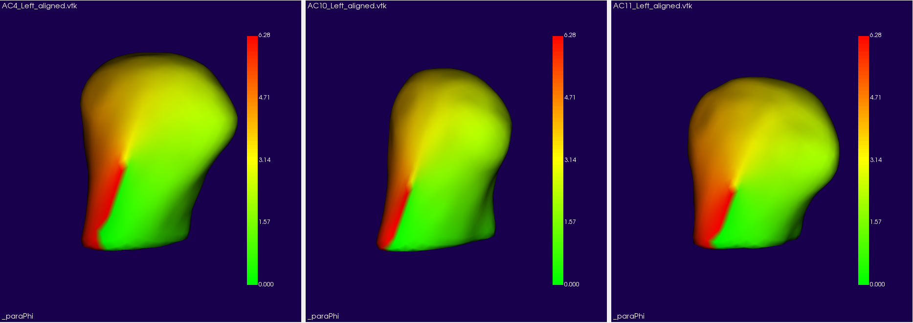
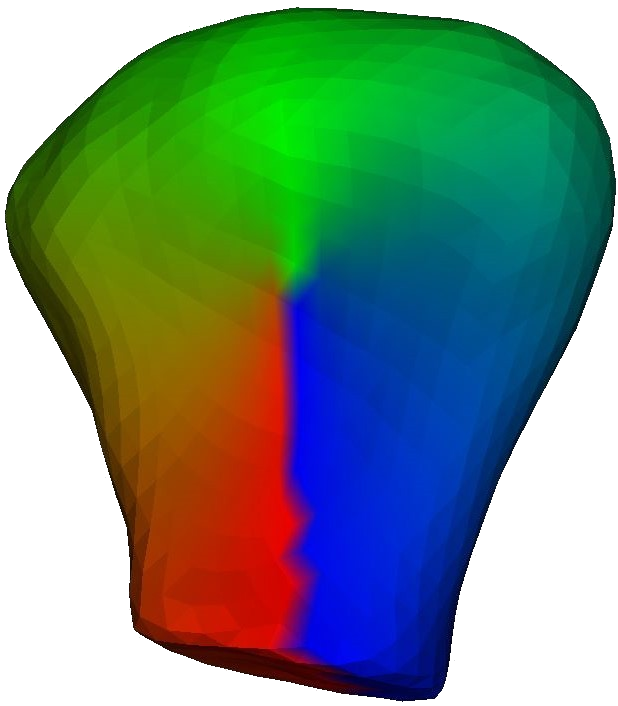
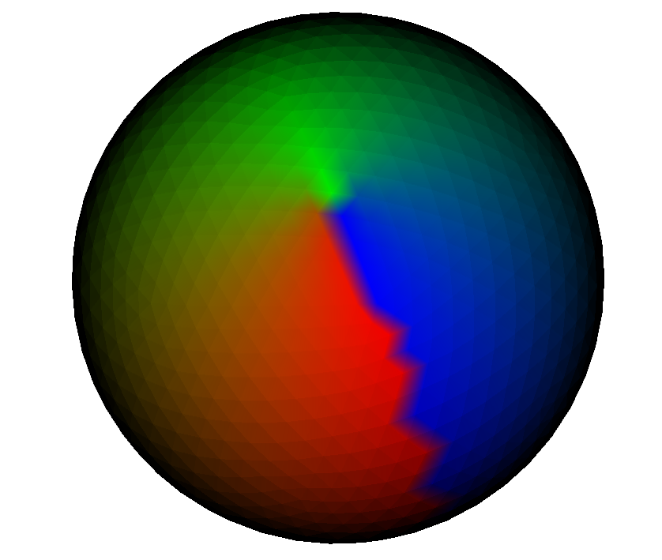
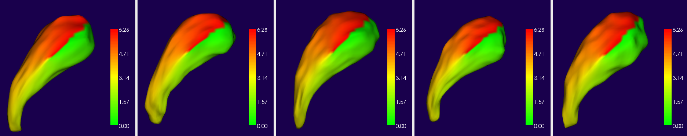
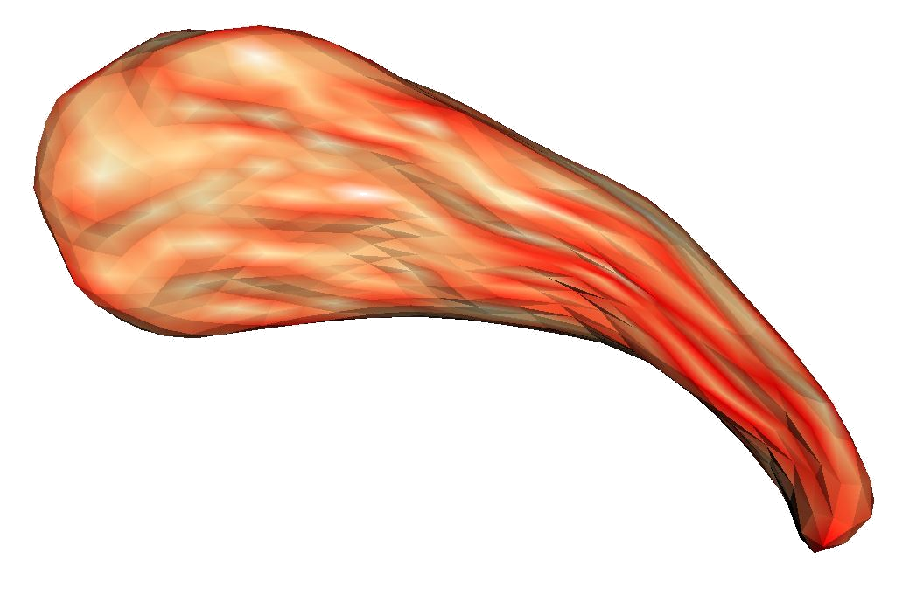
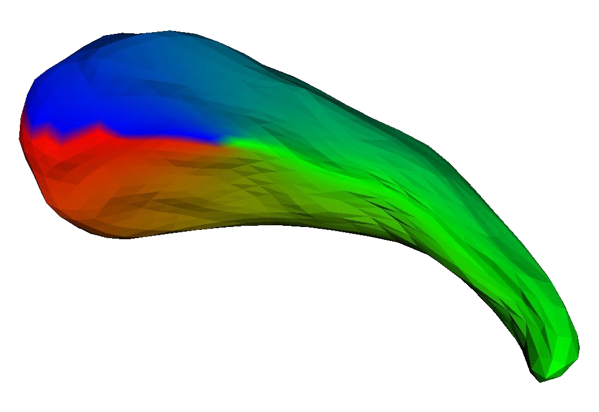
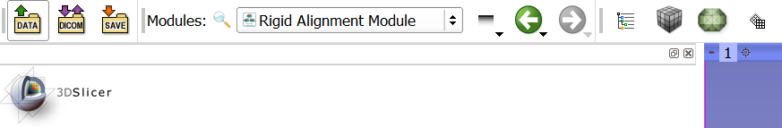
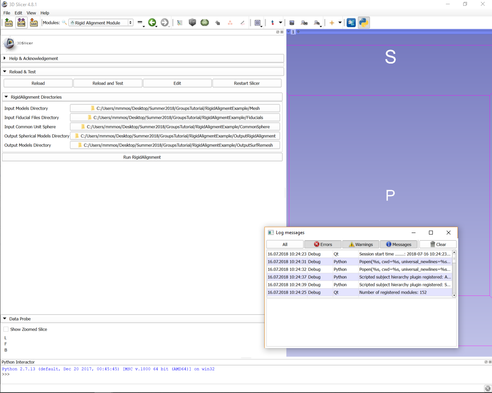
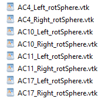
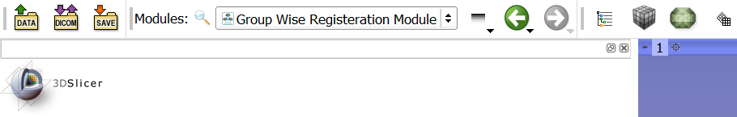

# GROUPS User Tutorial

Authors: Mahmoud Mostapha\, Ilwoo Lyu\, Martin Styner\, Beatriz Paniagua 

Collaborators:

                 

## GROUPS Tool Description

* Step 1: Landmark\-based Rigid Alignment
* Step 2: Group\-wise Shape Registration

## Description of GROUPS

Consistent shape correspondence is a prerequisite any group analysis investigating disease patterns and group variability.  Group\-wise Registration For Shape Correspondence \(GROUPS\) tool    is a general framework for establishing correspondence of 3D models that employs group\-wise registration in a spherical parametrization space. The inputs are spherical harmonics \(SPHARM\) point distribution models \(PDM\)  in addition to user\-defined geometrical features and landmarks\. The output is SPHARM\-PDM models with optimized correspondence obtained by minimizing the entropy of the joint distribution of features and landmarks at corresponding point locations.

The GROUPS tool consists of the following detailed steps: 

## Step 1 : Landmark\-based Rigid Alignment

This step will improve the SPHARM\-PDM initial correspondence using a set of user placed landmarks. Landmarks are defined in terms of 3D Slicer Fiducials \(\*\.fcsv\). Minimize the landmark distance errors on the sphere in terms of rigid alignment transformation. Surfaces are Remeshed using rotated parametrization spheres.

 _Figure:_ \(a\) initial landmarks of the SPHARM\-PDM surfaces\, and \(b\) aligned landmarks after rigid transformation on the sphere

 _Input: _   Surface Meshes 

**RigidWrapper CLI**

 _Output_    :    Rotated Parameterization Spheres 

 _Output_    :    Remeshed Surface 

 _Figure:_   : SPHARM\-PDM Meshs \(\*   _SPHARM\.vtk\) with user placed fiducals \(\*\.fcsv\) for each subject_ 

 _Figure_   : Common parametrization sphere obtained from the SPHARM\-PDM pipeline  \(\*   _surf\_para\.vtk\)_ 

 _Figure:_   Remeshed Surface using SurfRemesh CLI                   \(\* aligned\.vtk\)

 _Figure:_   Rotated parametrization sphere using RigidWrapper CLI \(\*   _rotSphere\.vtk\)_ 

## Step 2: Group\-wise Shape Registration 

This step will further improve correspondence  using group\-wise registration in a spherical parametrization space. Optimizing landmarks \(local\) and multidimensional features \(global\) by minimizing the joint entropy. Features are pre\-computed by the user and saved in SPHARM vtk files as point data arrays. Surfaces are Remeshed using aligned SPHARM coefficients 

 _Figure:_   \(a\) landmarks after rigid transformation on the sphere\, and \(b\) final landmark alignment using group\-wise shape registration 

 _Input: _   Surface Meshs 

**SurfRemesh CLIs**

 _Output_    :    Remeshed Surface 

 _Figure:_   Examples of geometrical features generated by the user and stored in the \(\*SPHARM\.vtk\) Surfaces as point data arrays\. \(a\) Curvedness generated using the SpharmTool in the SPHARM\-PDM pipeline

 _Figure:_ Examples of geometrical features generated by the user and stored in the \(\*SPHARM\.vtk\) Surfaces as point data arrays\. \(a\) Curvedness generated using the SpharmTool in the SPHARM\-PDM pipeline\. \(b\) Partial radius \(thickness\) generated when medial mesh is generated in the SPHARM\-PDM pipeline If landmarks to be used\, the user need to save landmarks as binary array of the Vertex IDs saved as an array called “Landmarks”

 Figure   : \(a\) SPHARM deformation coefficients \(\*coeff\) produced by the Groups CLI\. \(b\) The input surface is then remeshed \(\*SPHARM\.vtk\) using SurfRemesh CLI

## Installation of GROUPS Tool

* GROUPS tool can be used with two open\-source software platforms:
      * SlicerSALT : which is the dissemination vehicle of powerful shape analysis methodology\. This software is a light\-weight\, customized version of 3D Slicer\. It contains GROUPS  _as modules_
      * 3D Slicer : which is an open\-source and free software platform for medical image informatics\, image processing\, and three\-dimensional visualization\. GROUPS can be downloaded  _as an extension_

### GROUPS Installation on SlicerSALT

Download the SlicerSALT packages for your respective operating system from the   _[SlicerSALT website](http://salt.slicer.org/)_   and install it\. 

GROUPS Installation on 3D Slicer

  Download 3D Slicer packages for your respective operating system on the   _[3D Slicer website](https://www.slicer.org/)_   and install it

### GROUPS Installation on 3D Slicer

  In 3D Slicer\, open the Extension Manager

 In the    _Install Extension_    tab\, select    _Shape Analysis_    under    _Categories_ 

 Under    SPHARM\-PDM   \, select the    _Install_    button and restart Slicer when prompted   

For quality control\, we analyze our GROUPS outputs with    Shape Population Viewer    extension\. Shape Population Viewer can be installed as a 3D Slicer extension or as an external binary\. This module is included as part of the SlicerSALT package 

* To install    Shape Population Viewer    as    _a 3D Slicer extension_   : 
    * Open    _Extension Manager_   \, in the    _Install Extensions _   tab\, select ‘   _Shape Analysis’_    under    _Categories_ 
    *  Select the appropriate    _Install _   button and restart 3D Slicer when prompted

* To install    Shape Population Viewer    as an    _external binary_   : 
    *  Download ShapePopulationViewer package for your respective operating system on   _[NITRC website](https://www.nitrc.org/projects/shapepopviewer/)_
    *  In 3D Slicer\, open    _Application Settings _   in the    _Edit _   Menu\.  On the tab    _Modules_   \,    Add    the folder where  ShapePopulationViewer is stored
    *  Restart 3D Slicer

## Rigid Alignment Use

  * Rigid Alignment tool can be used by two different ways:
      * As  command\-line   tool  through the terminal thanks to SlicerSALT
      * As a  module  of SlicerSALT or 3D Slicer

### Rigid Alignment Command\-Line Tool

* Rigid Alignment method can be run on several cases through a terminal thanks to two files included in the SlicerSALT package: 
* RigidAlignment\-parameters\.ini which allows the user to specify the inputs\, outputs and the parameters of the RigidAlignment tool
* RigidAlignment\.py python script which will apply RigidAlignment method on the given input cases with the parameters specified in the RigidAlignment\-parameters\.ini file
*  _RigidAlignment\.py_    and    _RigidAlignment\-parameters\.ini files location: _ 
  *  _On Linux and Windows: share/Slicer\-4\.7/CommandLineTool_ 
  *  _On MacOs: Open the SlicerSALT Contents 			 _ 
  *  _🡪 Contents/share/Slicer\-4\.7/CommandLineTool_ 

*  Step 1   : Modification of the    _RigidAlignment\-parameters\.ini_    file by specifying the    directories    needed for tool CLIs
*  Step 2   : Launch Rigid Alignment  method with the following command\-lines: 
* On Linux and Windows: 
  *  _$cd path\-to\-the\-SlicerSALT\-package_ 
  *  _$\./SlicerSALT \-\-no\-main\-window \-\-python\-script share/Slicer\-4\.7/CommandLineTool/RigidAlignment\.py   share/Slicer\-4\.7/CommandLineTool/RigidAlignment\-parameters\.ini_ 
* On MacOs: 
  *  _$cd path\-to\-the\-SlicerSALT\-package/SlicerSALT\.app/Contents/MacOS_ 
  *  _$\./SlicerSALT \-\-no\-main\-window \-\-python\-script \.\./share/Slicer\-4\.7/CommandLineTool/RigidAlignment\.py \.\./share/Slicer\-4\.7/CommandLineTool/RigidAlignment\-parameters\.ini_ 

### Rigid Alignment Module 

In 3D Slicer or in SlicerSALT\, select    _Rigid Alignment Module _ 

from the    _Modules_    drop\-down menu \(   _Category:_    Shape Analysis\) or on the Search bar 

**Setting up Input Directories**

RigidAlignment tab 

For    _Input Models Directory_    _\,_       select the folder which contains the input surface meshs \(\*\.vtk\)

For    _Input Fiducial Files Directory_    _\,_    select the folder where the landmarks \(fiducials\) files are stored \(\*\.fcsv\)

For    _Input Common Unit Sphere_    _\,_    select the folder where the common parametrization sphere is stored \(\*\.vtk\)

**Setting up Output Directories**

 RigidAlignment tab 

For    _Output Spherical Models Directory_    _\,_       select the folder where the output of the RigidWrapper CLI will be stored \(\*\.vtk\)

For    _Output Models Directory_    _\,_    select the folder where the output of the SurfRemesh CLI will be stored \(\*\.vtk\)

**Running Rigid Alignment Module**

Click on the 

 _Run_        _RigidAlignment _   button\, to run the CLIs on the provided inputs

Shape Population Viewer will pop up to preview the input meshes giving the user the chance to inspect the input data before running the tool

Shape Population Viewer will pop up also after the module finished processing giving the user the chance to check the remeshed surfaces

 _3D Slicer’s Error Log_    can also be used for debugging if the module was completed with errors\. To open it\, click on the red icon at the bottom right\. 

 _3D Slicer’s Error Log_    can also be used for debugging if the module was completed with errors\. To open it\, click on the red icon at the bottom right\. 

The outputs files for the two sub\-steps of Rigid Alignment Module  are stored in the two folders specified by the user: 

### Group\-wise Registration Use

  * Group\-wise Registration  tool can be used by two different ways: 
      * As    command\-line       tool    through the terminal thanks to SlicerSALT
      * As a    module    of SlicerSALT or 3DSlicer

**Group\-wise Registration Command\-Line Tool**

* Group\-wise Registration method can be run on several cases through a terminal thanks to two files included in the SlicerSALT package: 
* GroupWiseRegistration\-parameters\.ini which allows the user to specify the inputs\, outputs and the parameters of the Group\-wise Registration tool
* GroupWiseRegistration\.py python script which will apply GroupWiseRegistration method on the given input cases with the parameters specified in the GroupWiseRegistration \-parameters\.ini file
*  _GroupWiseRegistration\.py_    and    _GroupWiseRegistration \-parameters\.ini files location: _ 
  *  _On Linux and Windows: share/Slicer\-4\.7/CommandLineTool_ 
  *  _On MacOs: Open the SlicerSALT Contents 			 _ 
  *  _🡪 Contents/share/Slicer\-4\.7/CommandLineTool_ 

*  Step 1   : Modification of the    _GroupWiseRegistration\-parameters\.ini_    file by specifying the    directories and parameters    needed for tool CLIs
*  Step 2   : Launch Group Wise Registration method with the following command\-lines: 
* On Linux and Windows: 
  *  _$cd path\-to\-the\-SlicerSALT\-package_ 
  *  _$\./SlicerSALT \-\-no\-main\-window \-\-python\-script share/Slicer\-4\.7/CommandLineTool/GroupWiseRegistration\.py   share/Slicer\-4\.7/CommandLineTool/GroupWiseRegistration\-parameters\.ini_ 
* On MacOs: 
  *  _$cd path\-to\-the\-SlicerSALT\-package/SlicerSALT\.app/Contents/MacOS_ 
  *  _$\./SlicerSALT \-\-no\-main\-window \-\-python\-script \.\./share/Slicer\-4\.7/CommandLineTool/GroupWiseRegistration\.py \.\./share/Slicer\-4\.7/CommandLineTool/GroupWiseRegistration\-parameters\.ini_ 

In 3D Slicer or in SlicerSALT\, select    _Group\-wise Registration Module _   from the    _Modules_    drop\-down menu \(   _Category:_    Shape Analysis\) or on the Search bar 

**Setting up Input Directories**

 Groups tab 

For    _Input Models Directory_    _\,_       select the folder which contains the input surface meshs \(\*SPHARM\.vtk\)

For    _Input Spherical Models Directory_    _\,_    select the folder where the spherical parametrization files are stored \(\*\_para\.vtk\)

**Setting up Output Directories**

 Groups tab 

For    _Output Coefficents Directory_    _\,_       select the folder where the output of the Groups CLI will be stored \(\*\.Coeff\)

For    _Output Models Directory_    _\,_    select the folder where the output of the SurfRemesh CLI will be stored \(\*\.vtk\)

**Features and Parameters**

 Groups Parameters tab 

Once the user specify the input models directory\, the geometrical features/prosperities stored in the vtk files are dynamically populated into a list where the user can select what features to include \(Weight >0\)

 
 Enable Use of Landmarks: Option for the user to select if landmarks will be included in improving the correspondence

 If enabled\, the user need to store the landmarks as a point data array called “Landmarks” indicating Vertex IDs to be selected \(Value > 0\)

 Figure   :    _Example of Landmarks stored in \*SPHARM\.vtk files _ 

Degree of SPHARM Decomposition: Degree value represents the degree of the spherical harmonic decomposition used to represent the computed deformation field

Changing this value results in different levels of detail of the deformation field that will be used to transform the input SPHARM mesh 

Maximum Number of Iterations: Number of iterations before the energy minimization optimization stops

 A higher number of iterations usually needed with increasing the number of subjects sin the dataset\, number of properties selected for the optimization procedure\, or with higher deformation field SPHARM degree

**Running Group\-wise Registration Module **

Click on the 

 _Run_    _  _    _Groups  _   button\, 

to run the CLIs on the provided inputs

Shape Population Viewer will be used again for quality control of the input meshs before running the tool\, in particular\, features planned to be included should be inspected by the user carefully 

Also\, Shape Population Viewer will be used to inspect the final correspondence established by the Group\-wise Registration tool

 _3D Slicer’s Error Log_    can also be used for debugging if the module was completed with errors\. To open it\, click on the red icon at the bottom right\. 

The outputs files for the two sub\-steps of Group\-wise Registration Module  are stored in the two folders specified by the user: 

## Acknowledgements \- Resources \- Questions

<ul>
  <li>The GROUPS developers gratefully acknowledge funding for this project provided by NIH NIBIB R01EB021391 (Shape Analysis Toolbox for Medical Image Computing Projects), as well as the Slicer community.</li>
  <li>Github repository:</li>
      <ul>
            <li><a href="https://github.com/NIRALUser/GROUPS">GROUPS</a></li>
            <li><a href="https://salt.slicer.org">SlicerSALT</a></li>
            <li><a href="https://github.com/Slicer/Slicer">3D Slicer</a></li>
      </ul>
  <li>Forums:</li>
      <ul>
            <li><a href="https://discourse.slicer.org/t/about-the-slicersalt-category/47">SlicerSALT</a></li>
            <li><a href="https://discourse.slicer.org/">3D Slicer</a></li>
      </ul>
  <li>Papers:</li>
      <ul>
            <li><a href="https://www.ncbi.nlm.nih.gov/pmc/articles/PMC4462677/">Robust estimation of group\-wise cortical correspondence with an  application to macaque and human neuroimaging studies</a></li>
            <li><a href="https://www.spiedigitallibrary.org/conference-proceedings-of-spie/10574/105742T/Group-wise-shape-correspondence-of-variable-and-complex-objects/10.1117/12.2293273.full?SSO=1">Group\-wise shape correspondence of variable and complex objects </a></li>
      </ul>  
  <li>For other remarks or questions, please email: beatriz.paniagua@kitware.com</li>
</ul>

