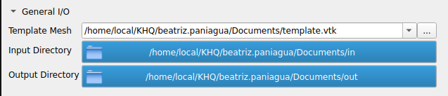
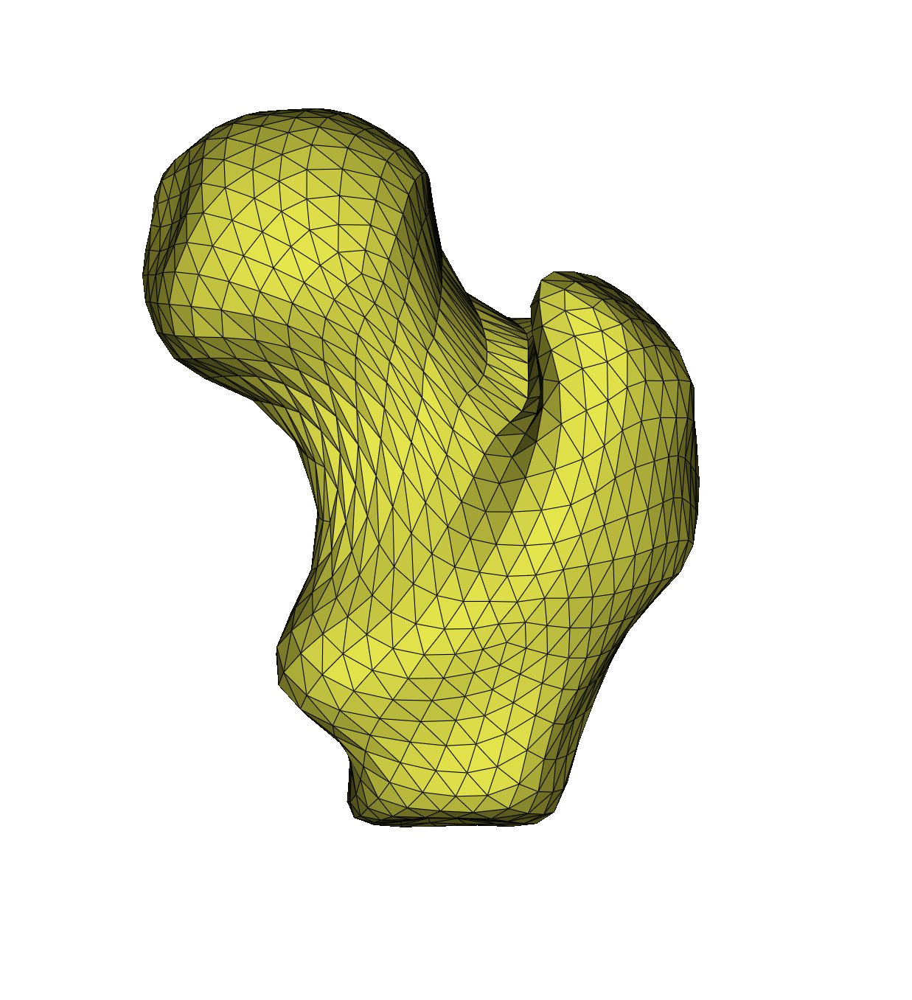
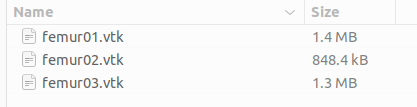
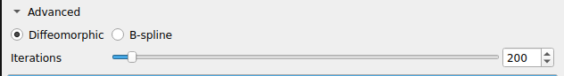
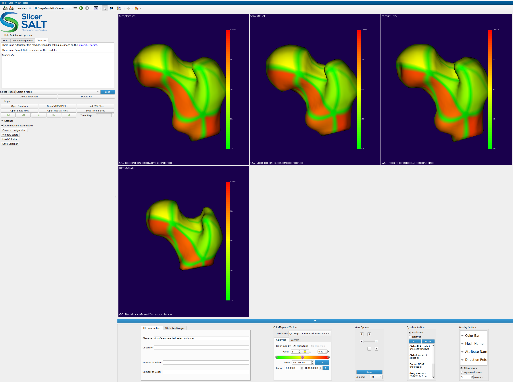

# Registration Based Correspondence User Tutorial

Authors: Beatriz Paniagua, David Allemang, Jared Vicory 

Collaborators: 

## Registration Based Correspondence Tool Description

This is a module for creating corresponding representations of objects with complex geometry or non-spherical topology. It takes a mesh of a representative object as a template and matches this template to other objects of the population via registration to create correspondence. 

### Input Parameters

 __Figure__   :    I/O tab after sample data has been downloaded 

__Template Mesh__

This is the triangulation that will be propagated to all of your sample data. The format is VTKPolyData

 __Figure__   :    Template example that can be found as part of the sample data for this module

__Input Directory__

All the geometries for which a new triangulation (e.g. template.vtk) is desired.

__Output Directory__

All the geometries generated with the new correspondence.

### Advanced I/O Parameters

 __Figure__   :    Advanced parameters tab

This tab allows the user to select from two different registration types as well as to select the amount of iterations of registration steps that will be run.

__Diffeomorphic Registration__

Diffeomorphic registration is a smooth, continuous, invertible, and preserves topology. We offer this type of registration in this module because it maintains the structural integrity of complex anatomical shapes while allowing very flexible deformations and thus perfect for complex geometries.

__B-spline Registration__

B-spline registration is an registration technique that uses B-spline functions (a type of piecewise polynomial) to model smooth, flexible, and local deformations between images. Unlike diffeomorphic registration, invertibility in B-splines is not guaranteed and they put more enphasis in local deformations and thus is useful when nonlinear anatomical variability exists between shapes.

__Iterations__

Tradeoff parameter between computation time and precision. It is useful to decide how closely we need the template to match each target shape. For the sample data, we recommend 5000 iterations.

### Quality control via Shape Population Viewer

After the computation has ended, Shape Population Viewer will automatically appear with both the template and the output geometries. There is an index based scalar map QC_RegistrationBasedCorrespondence that can be selected that is for quality controlling the correspondence accross geometries. Analogous anatomical regions should have the same points and result in analogous colors with this color map.

## Acknowledgements \- Resources \- Questions

<ul>
  <li> The Registration Based Correspondence developers gratefully acknowledge funding for this project provided by NIH NIBIB R01EB021391 (Shape Analysis Toolbox for Medical Image Computing Projects), as well as the Slicer community.</li>
  <li>Github repository:</li>
      <ul>
            <li><a href="https://github.com/slicersalt/RegistrationBasedCorrespondence">Registration Based Correspondence</a></li>
            <li><a href="https://salt.slicer.org">SlicerSALT</a></li>
      </ul>
  <li>Forums:</li>
      <ul>
            <li><a href="https://discourse.slicer.org/t/about-the-slicersalt-category/47">SlicerSALT</a></li>
            <li><a href="https://discourse.slicer.org/">3D Slicer</a></li>
      </ul>
  <li>Papers:</li>
      <ul>
            <li><a href="https://pmc.ncbi.nlm.nih.gov/articles/PMC10243214/">An open-source solution for shape modeling and analysis of objects of challenging topologies</a></li>
      </ul>  
  <li>For other remarks or questions, please email: beatriz.paniagua@kitware.com</li>
</ul>

