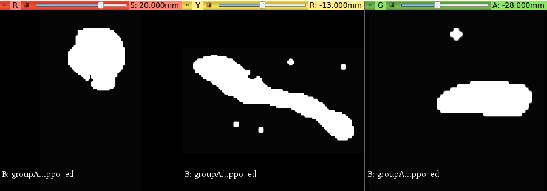
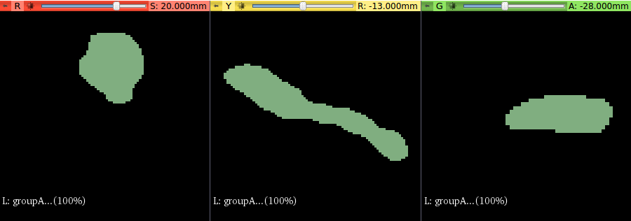
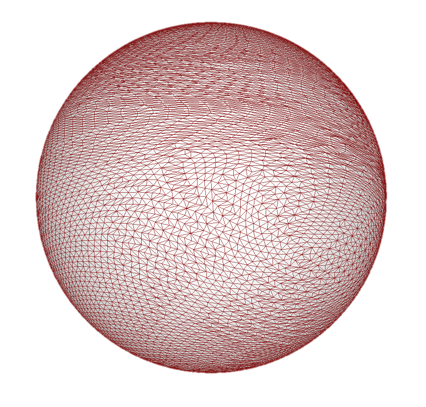
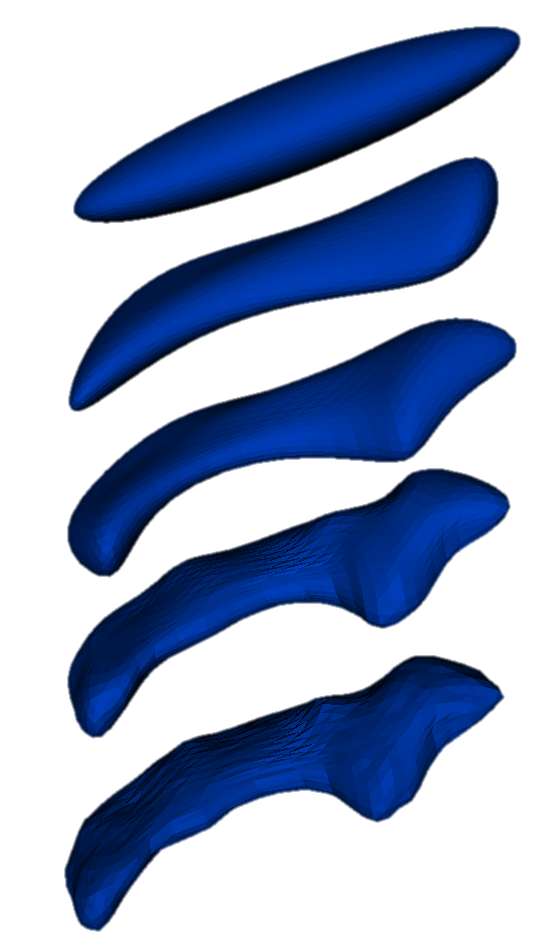

# SPHARM-PDM User Tutorial

Authors: Laura Pascal\, Jonathan Perdomo\, Martin Styner\, Hina Shah\, Beatriz Paniagua 

Collaborators: 

## SPHARM\-PDM Tool Description

Shape Analysis allows to precisely locate morphological changes between healthy and pathological structures\. Spherical Harmonic Representation Point Distribution Models \(SPHARM\-PDM\) tool is used to compute densely sampled correspondent point based models that allow performing 3D structural statistical shape analysis\.<

The inputs are _binary segmentations_ which are converted into corresponding _spherical harmonic descriptions_ \(SPHARM\) and then are sampled into _triangulated surfaces_ \(PDM\).

The SPHARM\-PDM tool consists on three steps: 

 _Step 1_    :    __Preprocessing__    uses SegPostProcess CLI

 &nbsp;&nbsp;&nbsp;&nbsp;_Input: Binary Segmentation_ 

 &nbsp;&nbsp;&nbsp;&nbsp;_Output: Binary 3D Image_ 

 _Step 2_    :    __Parameterization__    uses GenParaMesh CLI

&nbsp;&nbsp;&nbsp;&nbsp;_Input: Binary 3D Image_ 

&nbsp;&nbsp;&nbsp;&nbsp;_Output: Surface Mesh \+ Parameterization sphere_ 

 _Step 3_    :    __SPHARM\-PDM__    uses ParaToSPHARMMesh CLI

&nbsp;&nbsp;&nbsp;&nbsp;_Input: Surface Mesh \+ Parameterization sphere_ 

&nbsp;&nbsp;&nbsp;&nbsp;_Output: SPHARM Coefficients \+ Aligned Surface Meshes_ 

### Step 1: Post Process Segmentation 

This step will ensure spherical topology of the segmentations by filling any interior holes and by applying two smoothing operations and extract a single label or a label range

Re\-sample the label data to ensure an isotropic resolution and a relative fine resolution   

 _Input_   : Binary Segmentation 

 _Output_   : Binary Segmentation  File:    _\*pp_ 

 __Figure__   : Input/Output of SegPostProcess CLI

### Step 2: Generate Mesh Parameters

This step will extract the surface of the input label segmentation and create an area conforming mapping of the surface mesh to a unit sphere.

 _Note_   : If this step reports bad  Euler number\, it will mean that the extracted surface is not a spherical topology\. spherical topology has an Euler number of 2\.

 _Input_   : Binary 3D Image File    _\*pp_ 

 _Outputs_   : Parametrization sphere \+ Surface Mesh  Files:    _\*para\.vtk_   \+    _\*surf\.vtk_ 

  __Figure__   : Input/Output of GenParaMesh CLI

 __Figure__   :    __\*surf\.vtk__    is a surface approximation of the input file which represents the original voxel mesh: the cubes show the voxel delineation\. The surface will appear blocky because of it is the result of a marching cubes algorithm\.     

 __Figure__   :    __\*para\.vtk__    is a the  spherical mapping of the \*surf\.vtk file\. The sphere is an unit sphere \(diameter = 1\)

### Step 3: Parameters to SPHARM Mesh 

This step will: 
* Compute the SPHARM\-PDM representation
    * Compute the spherical harmonic description
    * Sample into a triangulated surface
    * The two main parameters for this step are: 
        * The degree for SPHARM computation 
        * The subdivision level for the icosahedron subdivision
* Resolves issues of correspondence pose and alignment

 __Figure__   : Input/Output of ParaToSPHARMMesh CLI

 __Figure__   : Comparison between the surface mesh generated by the Generate Mesh Parameters step \(red\) and the SPHARM\-PDM output \*   _SPHARM\.vtk_    \(blue\): 

 _Note_   : This figure shows how the final correspondent PDM represents the geometry of the structure without fitting the voxel mesh obtained from the binary segmentation

 __Figure__   : Visualization of    \*SPHARMMedialAxis\.vtk  \(red\)  and \*SPHARMMedialMesh\.vtk \(blue\)

 __Figure__   :    __\*para\.vtk __   is a sphere with a icosahedron subdivision of 10\. 

 _Note:_   The sphere has 1002 points and the triangulated surface generated will have the same number of points that this sphere\. This file includes the spherical parameters \(  φ\,θ  \) at each point\.

This sphere is also a unit sphere \(diameter = 1\)

 __Figure__   : Visualization of    _\*para\.vtk_   \(blue\)      and    _\*SPHARM\_Ellalign\.vtk_   \(red\)   which is aligned with the \*para\.vtk sphere:    

 __Figure__   : Spherical parameters color map files

 __Figure__   : Comparison of the spherical parameters color maps containing in the    _\*SPHARM\.vtk_   in ShapePopulationViewer tool: 

 
 __Figure__   : Medial mesh parameter color map files

 __Figure__   : Comparison of the Medial mesh parameter color maps containing in the    _\*_    _SPHARMMedialMesh\.vtk_    in ShapePopulationViewer tool

### Installation of SPHARM\-PDM Tool

* SPHARM\-PDM tool can be used with two open\-source software platforms:
      * __SlicerSALT__ : which is the dissemination vehicle of powerful shape analysis methodology\. This software is a light\-weight\, customized version of 3D Slicer\. It contains SPHARM\-PDM  _as a module_ \.
      * __3D Slicer__ : which is an open\-source and free software platform for medical image informatics\, image processing\, and three\-dimensional visualization\. SPHARM\-PDM can be downloaded  _as an extension_ \.

__Installation via SlicerSALT__

Download the SlicerSALT packages for your respective operating system from the   _[SlicerSALT website](http://salt.slicer.org/)_   and install it\. 

__Installation on 3D Slicer__

  Download 3D Slicer packages for your respective operating system on the   _[3D Slicer website](https://www.slicer.org/)_   and install it\.

  In 3D Slicer\, open the Extension Manager

  In the    _Install Extension_    tab\, select    _SPHARM_    under    _Categories_ 

 Under    __SPHARM\-PDM__   \, select the    _Install_    button and restart Slicer when prompted   

For quality control\, we analyze our SPHARM\-PDM outputs with    __Shape Population Viewer__    extension\. Shape Population Viewer can be installed as a 3D Slicer extension or as an external binary\. This module is included as part of the SlicerSALT package\.  

* To install    __Shape Population Viewer__    as    _a 3D Slicer extension_   : 
    * Open    _Extension Manager_   \, in the    _Install Extensions_   tab\, select ‘   _Shape Analysis’_    under    _Categories_ 
    *  Select the appropriate    _Install_   button and restart 3D Slicer when prompted

* To install    __Shape Population Viewer__    as an    _external binary_   : 
    *  Download ShapePopulationViewer package for your respective operating system on   _[NITRC website](https://www.nitrc.org/projects/shapepopviewer/)_
    *  In 3D Slicer\, open    _Application Settings_   in the    _Edit_   Menu\.  On the tab    _Modules_   \,    __Add __   the folder where  ShapePopulationViewer is stored
    *  Restart 3D Slicer

  * SPHARM\-PDM tool can be used by two different ways:
      * As  __command\-line__   __tool__  through the terminal thanks to SlicerSALT
      * As a  __module__  of SlicerSALT or 3DSlicer

__SPHARM\-PDM Command\-Line Tool__

* SPHARM\-PDM method can be run on several cases through a terminal thanks to two files included in the SlicerSALT package: 
* SPHARM\-PDM\-parameters\.ini which allows the user to specify the inputs\, outputs and the parameters of the SPHARM\-PDM tool
* SPHARM\-PDM\.py python script which will apply SPHARM\-PDM method on the given input cases with the parameters specified in the SPHARM\-PDM\-parameters\.ini file
*  _Location of the SPHARM\-PDM\.py_    and    _SPHARM\-PDM\-parameters\.ini files:_ 
  *  _On Linux and Windows: share/Slicer\-4\.7/CommandLineTool_ 
  *  _On MacOs: Open the SlicerSALT Contents 			_ 
  *  _🡪 Contents/share/Slicer\-4\.7/CommandLineTool_ 

 __Step 1__   : Modification of the    _SPHARM\-PDM\-parameters\.ini_    file by specifying the    __input directory path __   containing the input cases and    __the output directory path __   where the SPHARM\-PDM outputs will be stored\.

The others parameters can also be modified to apply SPHARM\-PDM to a particular case\. 

*  __Step 2__   : Launch SPHARM\-PDM method with the following command\-lines: 
* On Linux and Windows: 
  *  _$cd path\-to\-the\-SlicerSALT\-package_ 
  *  _$\./SlicerSALT \-\-no\-main\-window \-\-python\-script share/Slicer\-4\.7/CommandLineTool/SPHARM\-PDM\.py   share/Slicer\-4\.7/CommandLineTool/SPHARM\-PDM\-parameters\.ini_ 
* On MacOs: 
  *  _$cd path\-to\-the\-SlicerSALT\-package/SlicerSALT\.app/Contents/MacOS_ 
  *  _$\./SlicerSALT \-\-no\-main\-window \-\-python\-script \.\./share/Slicer\-4\.7/CommandLineTool/SPHARM\-PDM\.py \.\./share/Slicer\-4\.7/CommandLineTool/SPHARM\-PDM\-parameters\.ini_ 

### SPHARM\-PDM Module

In 3D Slicer or in SlicerSALT\, select    _Shape Analysis Module_    from the    _Modules_    drop\-down menu \(   _Category:_    SPHARM\) or on the Search bar\.  

__Setting up Input/Output Directories__

 _Group Project IO_     

For    _Input Directory_    _\,_       select the folder which contains the input data

For    _Output Directory_    _\,_    select the folder where the outputs of each step will be stored

__Input/Output Data__

* The    _input directory_    contains the input data which can be:  
  * Label map volumes \(\.gipl\, \.gipl\.gz\, \.nii\, \.nii\.gz\, \.nrrd\, \.mgh\, \.mgh\.gz\, \.mhd\, or \.hdr\) 
  * Models \(\.vtk\, or \.vtp\)
* The    _output directory_    will contain SPHARM output data sorted in three different folders for each of the three steps:
    *  _Step1\_SegPostProcess_       for the    _Post Processed Segmentation_   step
    *  _Step2\_GenMeshPara_       for the    _Generate Mesh Parameters_    step
    *  _Step3\_ParaToSPHARMMesh_       for the    _Parameters to SPHARM Mesh_   step   

### Features and Parameters

*  _Common to all_    __tabs__ 
* The    _Overwrite_       option: this option is available for the three steps of    _Shape Analysis Module_   : 
* If this option    __is not selected__    for one step\, it will skip the step if the output data were previously computed and stored in the output folder of this step: 
    * Folder    _Step1\_SegPostProcess_       for the    _Post Processed Segmentation_   step
    * Folder    _Step2\_GenMeshPara_       for the    _Generate Mesh Parameters_    step
    * Folder    _Step3\_ParaToSPHARMMesh_       for the    _Parameters to SPHARM Mesh_   step
* If this option    __is selected __   for one step\, all the files in the output folder of this step will be removed and the step won’t be skipped\. 

 _Post Processed Segmentation tab_ 

 _Rescale option_   : The X\, Y and Z spacing parameters \(sx/sy/sz\) determine the resolution in which the data will be processed for each axis \(in millimeters\)

 _Label Number option_   : First extraction of the specified label before to apply the post processing step

 _Generate Mesh Parameters_     

 _Number of iterations_   : Higher number of iterations will improve the accuracy of the mapping of the surface mesh to a parameterization sphere

| Number of iterations |
| :-: |
| 5 |
| 1000 |

 __Figure__   :    _\*SPHARM\.vtk_    generated with 5 iterations \(top\) and 1000 iterations \(bottom\)   

 _Note_   : Higher number of iterations will produce better representation results\.

 _Parameters to SPHARM Mesh_     

 _Subdivision Level value_   : Icosahedron subdivision allows for linear\, uniform sampling of the object by referring to its spherical parameterization\. The    _SubdivLevel_    value sets the level of the subdivision factor that will be used\. Improving this value results in a SPHARM mesh with more points\.   

 _Parameters to SPHARM Mesh_     

 _Subdivision Level value_   :    

 __Figure: __    _\*para\.vtk_   generated with 5 subdivision different   \(left to right : 2 – 4 – 6 – 10 \- 20\)     

| Subdivision Level | 2 | 4 | 6 | 10 | 20 |
| :-: | :-: | :-: | :-: | :-: | :-: |
| Number of Points | 42 | 162 | 362 | 1002 | 4002 |

 _Parameters to SPHARM Mesh_     

 _Subdivision Level value_   :    

 __Figure__    _: \*SPHARM\.vtk_   generated with a subdivision level of 2 \(left\) and 10 \(right\)

 _Note_   : Higher subdivision level value will result in a smoother surface mesh\.      

| Subdivision Level | 2 | 10 |
| :-: | :-: | :-: |
| Number of points | 42 | 1002 |

 _Parameters to SPHARM Mesh_     

 _SPHARM Degree value_    represents the degree of the spherical harmonic series used on the data\. Changing this value results in different levels of detail of the object\. 

 _Parameters to SPHARM Mesh_     

 _SPHARM Degree_   : 

| SPHARM degree |
| :-: |
| 1 |
| 3 |
| 5 |
| 10 |
| 25 |

 __Figure: __    _\*SPHARM\.vtk_       generated with different SPHARM degree \(left to right: 1 – 3 – 5 – 10 – 25\)  

 _Note_   : A higher SPHARM degree value will result in a surface mesh with more details\. 

 _Parameters to SPHARM Mesh_     

 _Build the medial mesh:_    This option will compute the mean latitude axis associated with the data if checked\. The Number of theta/phi iterations corresponds to the number of samples used in the medial mesh computation  1  \.   

1\. Paniagua B1\, Lyall A\, Berger JB\, Vachet C\, Hamer RM\, Woolson S\, Lin W\, Gilmore J\, Styner M\. \(2013\)\. Lateral ventricle morphology analysis via mean latitude axis\. Proc SPIE Int Soc Opt Eng\. 2013 Mar 29;8672\. pii: 2006846\. \<http://www\.ncbi\.nlm\.nih\.gov/pubmed/23606800>

 _Advanced Post Processed Segmentation_     

 _Gaussian filtering_   : A Gaussian filter will be applied during the preprocessing step if this option is checked\.

 _Advanced Parameters to SPHARM Mesh_     

 _Registration template Options_   : This option allows to have a rigid\-body Procrustes alignment i\.e\. the    _\*SPHARM\_procalign_   mesh generated by the tool will be aligned with the registration template \(VTK file\) by applying\, if needed\, a rigid transformation \(which uses only translation and/or a rotation\)\. 

 _Advanced Parameters to SPHARM Mesh_     

 _Flip template Options_   : If    _Use Flip Template_    is checked\, a    _Flip Template_   is used to test all possible flips of the parametrization along the first order ellipsoid axis and select the one whose reconstruction has minimal distance to the flip\-template\. 

 _Advanced Parameters to SPHARM Mesh_     

 _Flip Options_   : This option allows an optional flipping of the parametrization specified by the user\.

 _Advanced Parameters to SPHARM Mesh_     

 _Flip Options_   : To apply the same flip option for each case\, check    _Same Flip for all the outputs_   \. 

Select    __one flip along an axis__    or choose to apply    __all the flips__    to determine the best flip\.

 _Advanced Parameters to SPHARM Mesh_     

 _Flip Options_   : To apply different flip options for each case\, uncheck    _Same Flip for all the outputs_   \. 

As previously\, select a flip option for each case\.

 _Advanced Parameters to SPHARM Mesh_     

 _Flip Options_   : Example of an application of all the flips on one case by iterating 7 times    _ParaToSPHARMMesh_    CLI\. This figure shows a comparison of different flips in    _Shape Population Viewer\._ 

 _Flip Along X Axis_ 

 _Flip Along Y Axis_ 

 _Flip Along Z Axis_ 

 _Flip Along_    _X and Y Axis_ 

 _Flip Along_    _X and Z Axis_ 

 _Flip Along_    _Y and Z Axis_ 

 _Flip Along X\, Y and Z Axis_ 

 

 __Figure__   : Visualization in ShapePopulationViewer of the different flips applied on    _\*SPHARM_    model\.   

### Running SPHARM\-PDM

Click on the Run    _ShapeAnalysisModule_    button\, to run the three steps on the provided inputs\. 

Progress bars will indicate when the computation is done and if the computation for each case was completed with or without error\.

If the module was completed with errors\, the step which was completed with errors is indicated and the errors can be displayed by clicking on the little arrows:

 _3D Slicer’s Error Log_    can also be used for debugging if the module was completed with errors\. To open it\, click on the red icon at the bottom right\. 

The outputs files for each step of SPHARM\-PDM are stored in three folders in the output directory previously selected: 

### Quality control using  ShapePopulationViewer

If    _Shape Population Viewer_   is installed\, the Visualization tab will be enabled: 

 __Note__   :    _ShapePopulationViewer_    is installed by default in SlicerSALT 

The selection of the SPHARM outputs which will be displayed in    _Shape Population Viewer_   can be done thanks to the checkable combobox or with the checkbox corresponding to them: 

Run    _Shape Population Viewer_   by clicking on the    _Shape Population Viewer_   button: 

To display the selected models in    _Shape Population Viewer_   \, click on    _VTK Files_    and then    _Ok_   : 

To display the different color maps on the meshes\, use the comboBox Attributes:  

 __Figure__   : Visualization in ShapePopulationViewer of two \*SPHARM models with the phi spherical parameter representation

* Example: This view shows the phi correspondences between the files\.
  * Quality control of the correspondences is performed using the color\-coded parameterization information\.
  * Equally colored areas represent equal corresponding area\.  

groupA\_01\_hippo\_pp\_surf\_SPHARM\.vtk

groupA\_01\_hippo\_pp\_surf\_SPHARM\.vtk

groupA\_01\_hippo\_pp\_surf\_SPHARM\.vtk

groupA\_01\_hippo\_pp\_surf\_SPHARM\.vtk

 __Figure__   : Visualization in ShapePopulationViewer of multiples    _\*SPHARM_    shapes displaying paraPhi color map

* Only data sets with Procrustes alignment information are automatically aligned in    _Shape Population Viewer_   \.
* For data sets without Procrustes alignment:
  * Under    _View Options_   \, set    _Aligned_    to    __On __   to align the data set using file information\.  

For more information about using    _Shape Population Viewer_   tool\, consult the   _[ShapePopulationViewer tutorial](https://www.nitrc.org/docman/view.php/759/1339/User%20Tutorial%20v1.3.2)_   by Alexis Girault\.

### Quality control using   _Models_   module

Models can be viewed in    _3D Slicer_    or    _SlicerSALT_   by dragging and dropping the files or by using the    _Data_   button in the toolbar to search for the file\.

When importing the VTK file\, select the    _Model_   Option : 

When the VTK file has been imported\, it will be visualized in the    _Scene View_    \(or the 3D View\)\. Switch to the    _Models_    Module to change the display settings of the VTK model\. 

 _Hide/show_    the model by clicking on the eye icon

To change the display properties of the VTK file\, first    _select_    the file from the    _Scene window_    in the    _Models_    Module

Change the    _representation_       of the model mesh\. For example\,    _Wireframe_    representation will display the meshing of the model

Change the    _color_    of the mesh from the default gray color

Change the    _opacity_    of the mesh  

## Acknowledgements \- Resources \- Questions

<ul>
  <li> The SPHARM-PDM developers gratefully acknowledge funding for this project provided by NIH NIBIB R01EB021391 (Shape Analysis Toolbox for Medical Image Computing Projects), as well as the Slicer community.</li>
  <li>Github repository:</li>
      <ul>
            <li><a href="https://github.com/NIRALUser/SPHARM-PDM">MFSDA</a></li>
            <li><a href="https://salt.slicer.org">SlicerSALT</a></li>
            <li><a href="https://github.com/Slicer/Slicer">3D Slicer</a></li>
      </ul>
  <li>Forums:</li>
      <ul>
            <li><a href="https://discourse.slicer.org/t/about-the-slicersalt-category/47">SlicerSALT</a></li>
            <li><a href="https://discourse.slicer.org/">3D Slicer</a></li>
      </ul>
  <li>Papers:</li>
      <ul>
            <li><a href="https://www.ncbi.nlm.nih.gov/pubmed/23606800">Lateral ventricle morphology analysis via mean latitude axis.</a></li>
            <li><a href="https://www.ncbi.nlm.nih.gov/pmc/articles/PMC3062073/">Framework for the Statistical Shape Analysis of Brain Structures using SPHARM\-PDM</a></li>
      </ul>  
  <li>For other remarks or questions, please email: beatriz.paniagua@kitware.com</li>
</ul>

