# Shape Variation Analyzer User Tutorial

Authors: Mateo lopez\, Priscille de Dumast\, Juan C\. Prieto\, Martin Styner\, Beatriz Paniagua 

Collaborators: 

## ShapeVariationAnalyzer Tool Description

Step 1: Create the different groups

Step 2: Preview and group update  

Step 3: Generate and explore models

Step 4: Evaluate the models

## Description of ShapeVariationAnalyzer

 Shape Variation Analyzer \(SVA\)    allows the computation of PCA decomposition of groups of shapes in order be able to represent them in a lower dimensional space\.    SVA    also allows the user to explore the generated PCA space and to evaluate the quality of the generated models\.

The inputs meshes are vtk files\, they must have corresponding points to be processed by SVA\. If it is not the case\, SlicerSALT provides tools that are able to convert the data set\.

The SVA tool consists on four steps: 

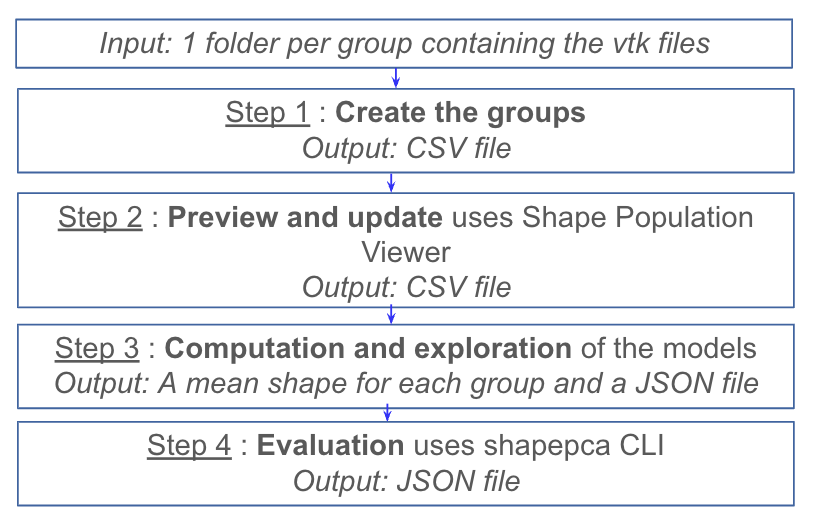

### Step 1: Create the groups

This step will generate a CSV file describing the location of each shape and their corresponding group\. To do so a folder per group should be created\. 

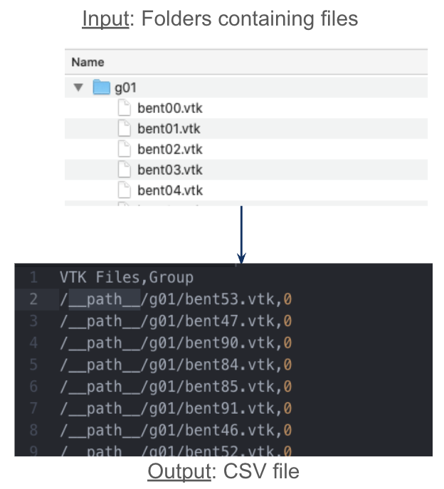

 Figure   : Input/Output for the creation of groups

### Step 2: Preview and Update

This step will allow the user to visualize the groups in Shape Population Viewer\. 

He will be able modify groups before computation\, if it is necessary\.

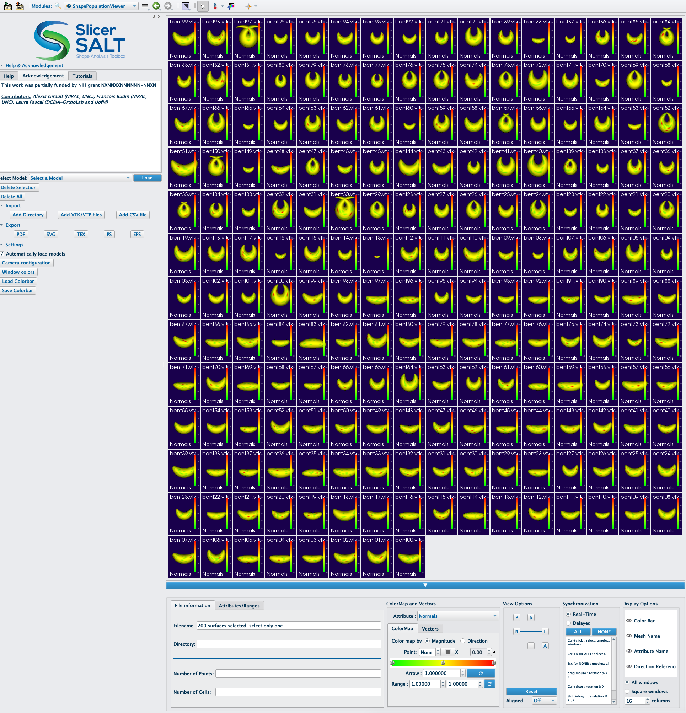

### Step 3: Generate and Explore Models 

Generating the PCA representation will compute the explained variance ratio and the cumulative sum of the explained variance ratio. You can project each group on the two first component and compute a mean shape for each group\.

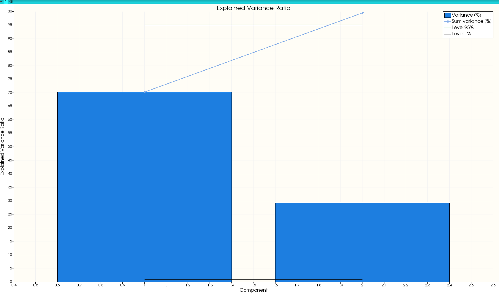

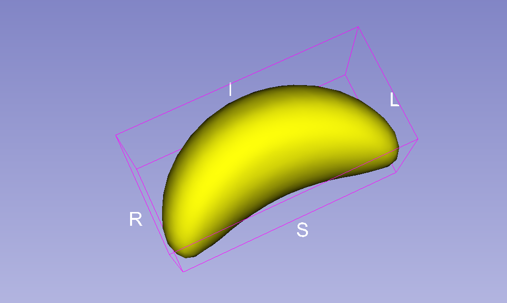

The exploration of the models allows to:	

* Generate new shapes with sliders representing each component of the PCA model
* Visualize the distance of the current shape compared to the mean shape of the group\.
* Visualize a particular member of a group\, or the mean shape of a sub\-group

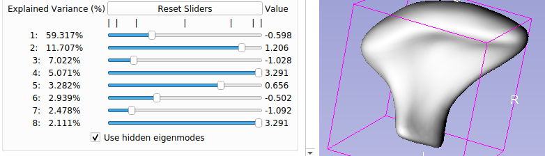

Individual population shape in showing a heat map of differences compared with the mean shape in white in the figure below.

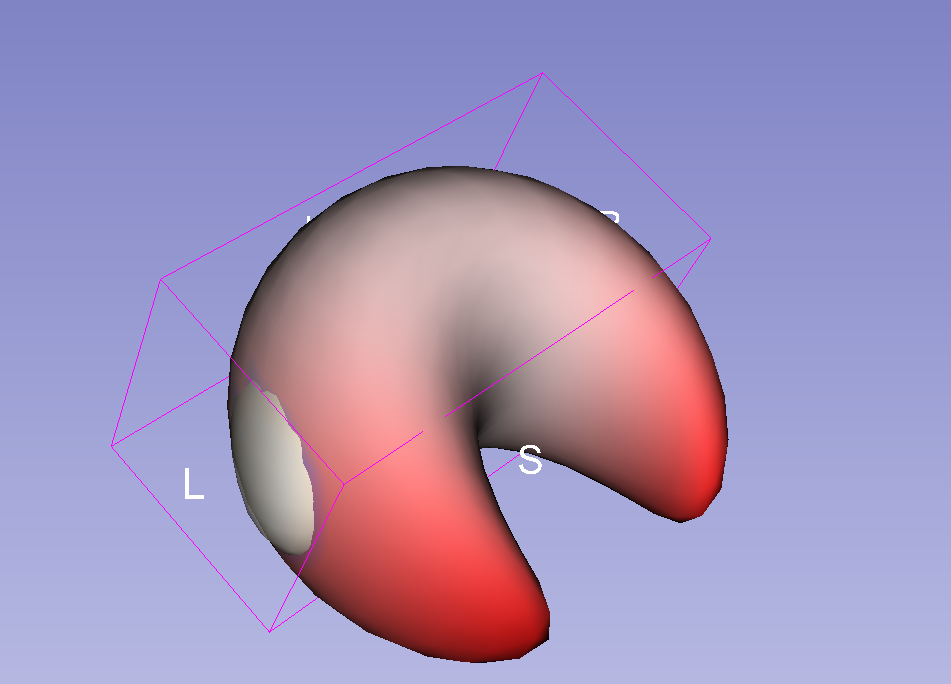

### Step 4: Evaluate the models  

This  step will evaluate the models by computing three values:

* _Model compactness_: A compact model is one that has as little variance as possible and requires as few parameters as possible to define an instance\. 
* _Model generalization_: The generalization ability of a model measures its capability to represent unseen instances of the object class\. This is a fundamental property as it allows a model to learn the characteristics of an object class from a limited training set\. 
* _Model specificity_: A specific model should only generate instances of the object class that are similar to those in the training set\. It is useful to assess this qualitatively by generating a population of instances using the model and comparing them to the members of the training set\. 

## Installation of SVA Tool

SVA tool can be used with two open\-source software platforms: 
*  SlicerSALT   : which is the dissemination vehicle of powerful shape analysis methodology\. This software is a light\-weight\, customized version of 3D Slicer\. It contains SVA    _as a module_   \. 
*  3D Slicer   : which is an open\-source and free software platform for medical image informatics\, image processing\, and three\-dimensional visualization\. SVA can be downloaded    _as an extension_   \.  

### SVA Installation on SlicerSALT

Download the SlicerSALT packages for your respective operating system from the   _[SlicerSALT website](https://salt.slicer.org/)_   and install it\. SVA will be ready to use then\. 

### SVA Installation on 3D Slicer

  Download 3D Slicer packages for your respective operating system on the   _[3D Slicer website](https://www.slicer.org/)_   and install it\.

  In 3D Slicer\, open the Extension Manager

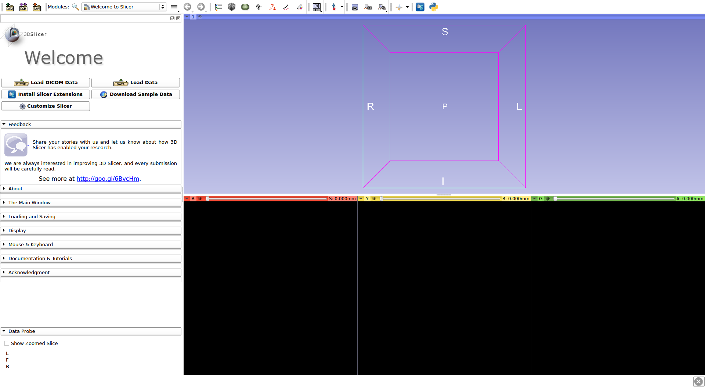

  In the    _Install Extension_    tab\, select    _ShapeVariationAnalyzer_    under    _Categories_ 

 Under    ShapeVariationAnalyzer   \, select the    _Install_    button and restart Slicer when prompted. 

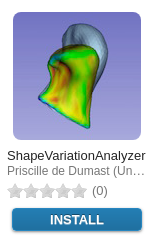

To visualize groups before the computation\,SVA uses    Shape Population Viewer    extension\. Shape Population Viewer can be installed as a 3D Slicer extension or as an external binary\. This module is included as part of the SlicerSALT package\.  

To install    Shape Population Viewer    as    _a 3D Slicer extension_   : 
* Open    _Extension Manager_   \, in the    _Install Extensions _   tab\, select ‘   _Shape Analysis’_    under    _Categories_ 
*  Select the appropriate    _Install _   button and restart 3D Slicer when prompted

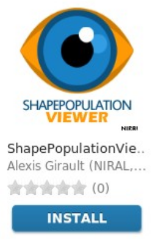

To install    Shape Population Viewer    as an    _external binary_   : 
*  Download ShapePopulationViewer package for your respective operating system on    _NITRC website_ 
*  In 3D Slicer\, open    _Application Settings _   in the    _Edit _   Menu\.  On the tab    _Modules_   \,    Add    the folder where  ShapePopulationViewer is stored
*  Restart 3D Slicer

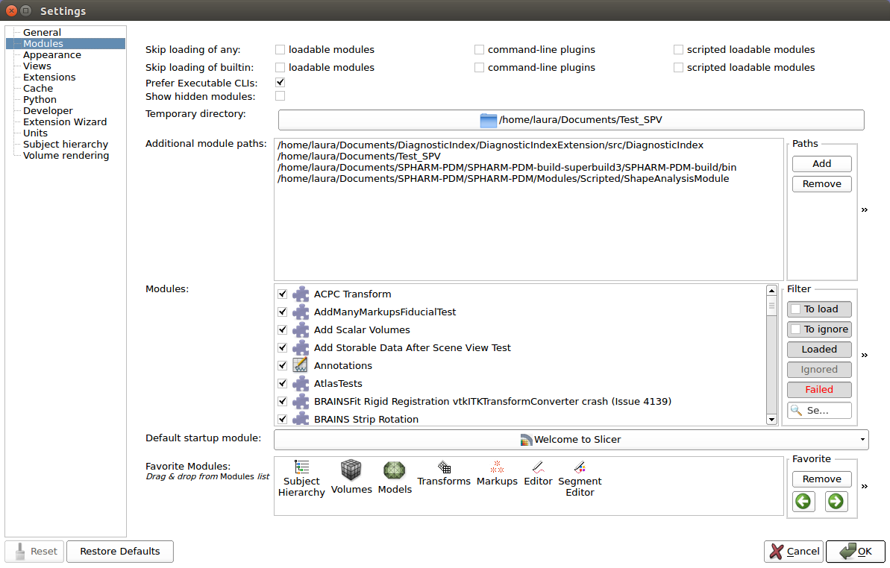

## How to use ShapeVariationAnalyzer

In 3D Slicer or in SlicerSALT\, select    _ShapeVariationAnalyzer_    from the    _Modules_    drop\-down menu \(   _Category:_    Decomposition\) or on the Search bar\.  

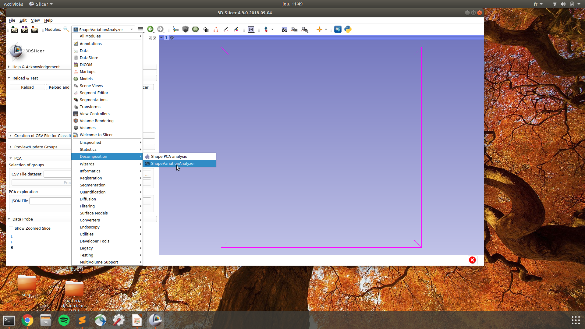

### Setting up the input directories

The SVA tool process PCA models for different groups at the same time and a general model that combine all the groups\. To do so\, the input files should be organized in folders\, one folder per group\. 
Remember:
* Every file must have corresponding points
* Only \.vtk files are supported

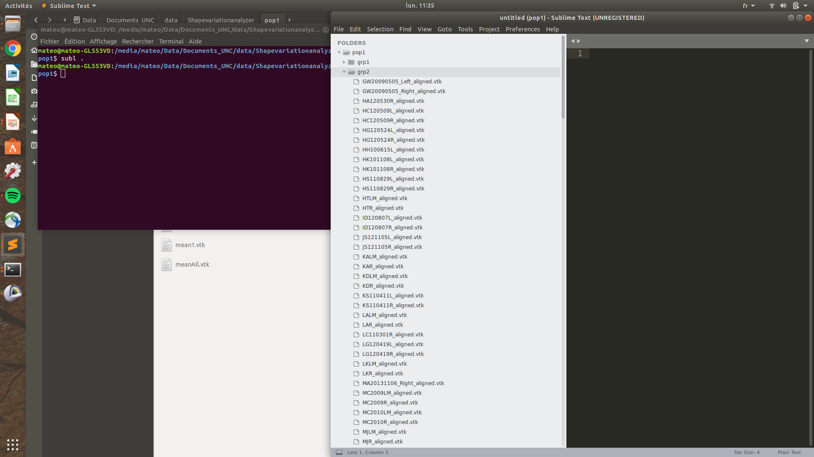

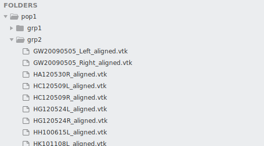

### Create the Groups

**Tab: Creation of CSV file** 

To add a group\, select the desired folder and click the ‘Add Group’ Button to add it\. Note that adding a group will  give it a group  number

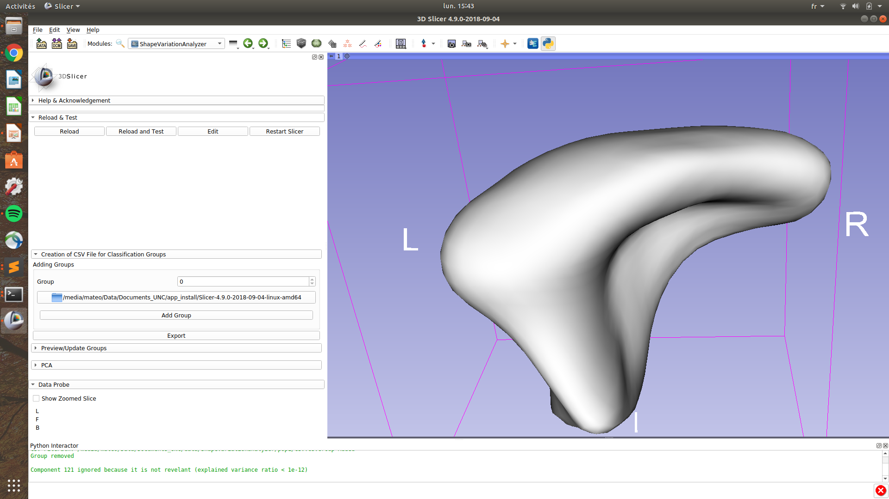

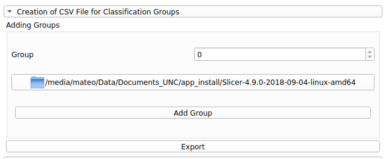

Edit a group folder: To edit a group\, select the desired group number in the spin box\, two new options appears:
* Remove group: remove the current group from the list of groups
* Modify group: This option update the current group by associating it with the current selected folder  

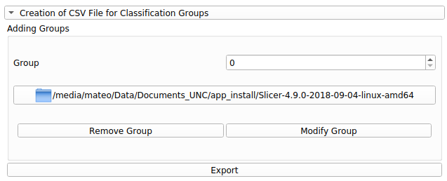

Export groups: When all the groups have been created\, use the Export button to save the CSV file describing the groups\. The path of this file is automatically passed to the other tabs of the module\. 

**Tab: Preview/Update Group** 

To make sure that the groups are correctly defined\, SVA offers the possibility to visualize each element of a group using the Shape Population Viewer \(SPV\) module:

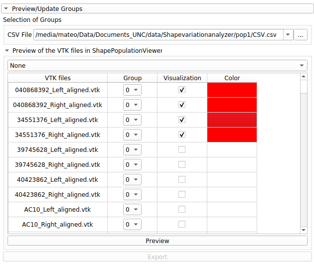

* Select all the shapes that you want to visualize by marking the corresponding check box
* Use the preview button to launch SPV

If a shape is identified as being part of the wrong group\, change his group number and use the Export button to update the csv file\. 

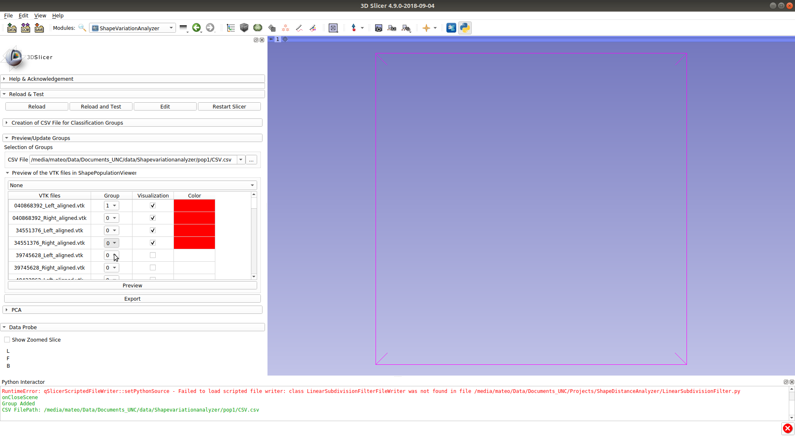

**Tab: Exploration** 

1\): Generate the models

Select the desired CSV file previously generated and use the Process and Export button to generate the models and import them in the explorer\. The exploration interface will appear:

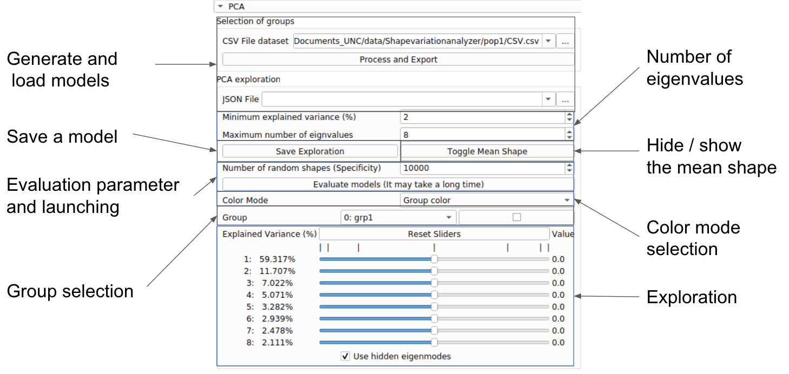

2\): Save and load a model:
* We recommend to save your models before starting the exploration by using the save button: specify a \.json file \(ex: exploration\.json\) where the exploration should be saved\. 
* The following files will be generated:
    * The specified JSON file  
    * A VTK file per group representing the mean shape of the group
    * A PYC file necessary for pca computation
* To load an existing exploration\, select a previously generated json file in the ‘JSON file’ field\.

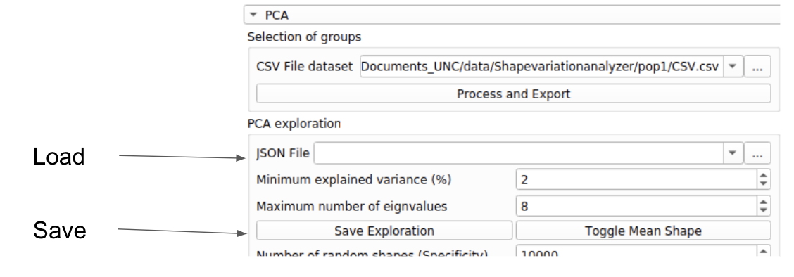

3\)Exploration: 

_Groups:_ Define colors for each groups\, navigate between groups using the 	group option\.   

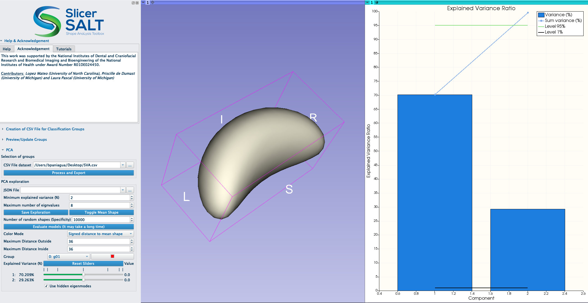

_Eigenvalues:_ To start exploring the PCA space\, use the eigenvalues sliders

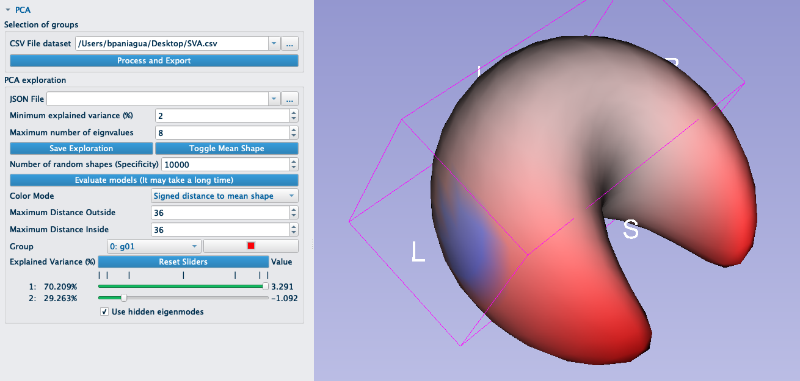

If you want to play with more sliders\, you can use the minimum explained variance and the maximum number of eigenvalues to add more sliders 

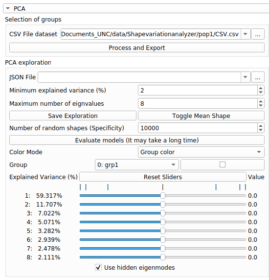

_Visualization of the distance:_ It is possible to visualize the distance between the current shape and the mean shape by changing the color mode in the SVA interface\, keep in mind that the distance is computed using the corresponding points of the shape\, not the closest point\. 

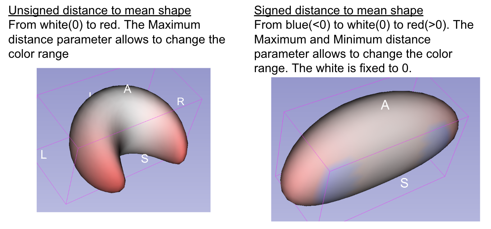

_Plot Visualization and interaction:_ By default\, the Explained Variance Ratio plot appears when a model is generated or loaded\. It shows\, for the selected group\, the explained variance for each eigenvalue in a bar plot\, and the cumulative sum of the explained variance\.

To see the projection of the group on the 2 first component of the PCA model\, select the 'PCA projection plot chart' plot using the top left menu of the plot area:

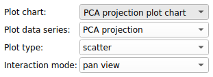

On the plot below, you can select a point\, the corresponding shape will be displayed by updating the sliders value\. If you select a group of points\, the mean shape of those points will be displayed\. 

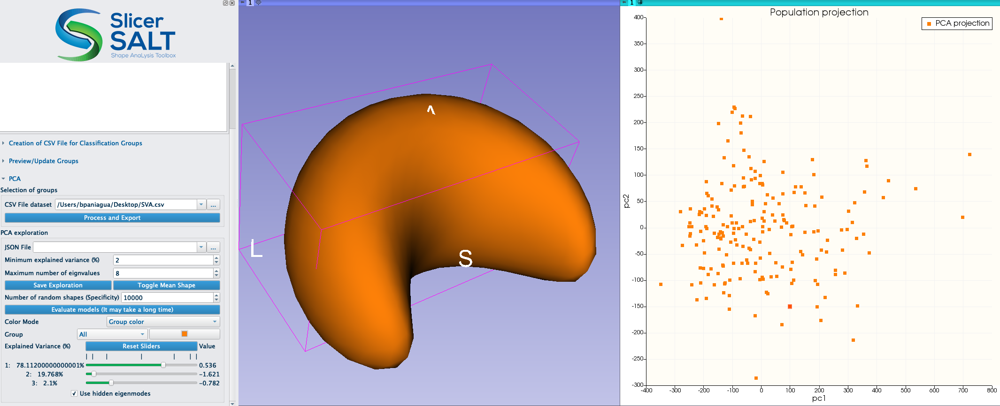

4\) Evaluation:

To make sure that the generated models are well defined\, SVA can evaluate the models by computing the compactness\, specificity and generalization and visualize them in the plot area\.

* Parameters: 	
    * The number of eigenvalues are determined by the number of sliders available when the evaluation is launched\.
    * The number of random shapes parameter allow to choose how many shapes should be generated to compute the specificity\.

To launch the evaluation\, use the Evaluate models button\. The evaluation is a long process\, if you want to abort it\, you can use the same button\.

When the evaluation is done\, you can visualize the results by selecting in the plot area menu the PCA Specificity plot chart\, the PCA Compactness plot chart or the PCA Generalization plot chart\.

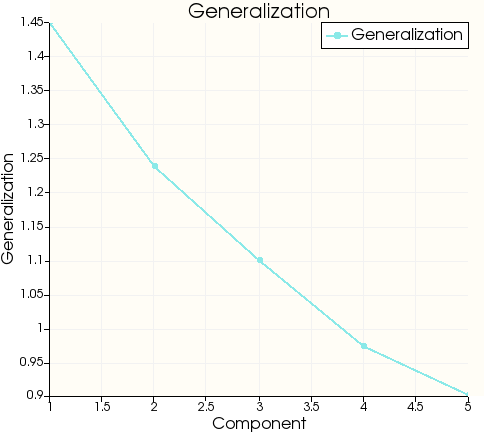

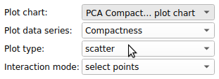

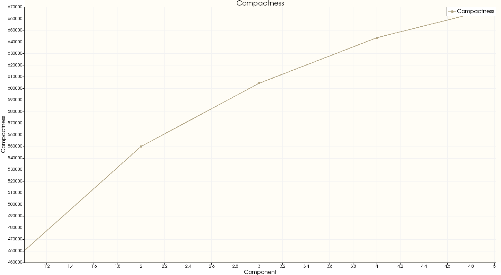

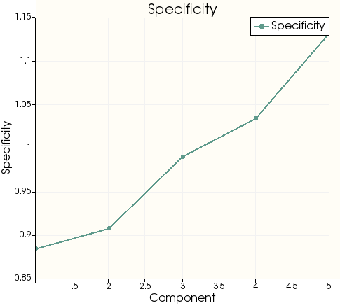

## Acknowledgements \- Resources \- Questions

<ul>
  <li> The Shape Variation Analyzer developers gratefully acknowledge funding for this project provided by NIH NIBIB R01EB021391 (Shape Analysis Toolbox for Medical Image Computing Projects), as well as the Slicer community.</li>
  <li>Github repository:</li>
      <ul>
            <li><a href="https://github.com/DCBIA-OrthoLab/ShapeVariationAnalyzer">Shape Variation Analyzer</a></li>
            <li><a href="https://salt.slicer.org">SlicerSALT</a></li>
            <li><a href="https://github.com/Slicer/Slicer">3D Slicer</a></li>
      </ul>
  <li>Forums:</li>
      <ul>
            <li><a href="https://discourse.slicer.org/t/about-the-slicersalt-category/47">SlicerSALT</a></li>
            <li><a href="https://discourse.slicer.org/">3D Slicer</a></li>
      </ul> 
  <li>For other remarks or questions, please email: beatriz.paniagua@kitware.com / Juanprietob@gmail.com</li>
</ul>
