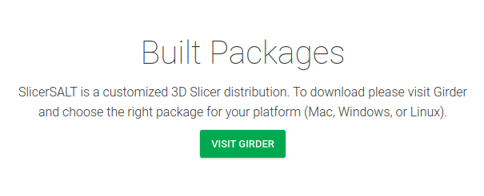

# Shape analysis via Skeletal Models User Tutorial

Authors: Zhiyuan Liu\, Stephen M\. Pizer\, Beatriz Paniagua\, Jared Vicory\, Junpyo Hong\, Connor Bowley

## Introduction to skeletal representations

Shape Analysis allows studying morphology in populations of anatomic structures\. A    __skeletal representation \(s\-rep\) is__    used to model the structure of an object with no essential interior branches\, providing a rich geometric representation with correspondence across cases\. 

The S\-rep Extension \(short for    __Skeletal Representation Extension__   \) in SlicerSALT provides utilities to visualize\, initialize and refine s\-reps of 3\-dimensional objects\.

Figure: Some examples have been researched via s\-rep

Left: caudate nucleus Middle: hippocampus Right: cerebral ventricle 

## The Slabular S\-rep

A 3D object whose length is notably larger than its width which is notably larger than its thickness is suitable for modeling by a slabular s\-rep\.

A slabular s\-rep \(from now on just referred to as an s\-rep\) 

consists first of a folded\, two\-sided quasi\-medial sheet inside the object\.  This sheet is called the “skeletal sheet”\. It is sampled into a network of skeletal positions\.

Special skeletal samples are at positions where the sheet folds back onto itself\.

Figure: A skeletal model for a hippocampus\. Left: the surface mesh of hippocampus\. Right: the skeletal sheet of the s\-rep of this hippocampus

From each sample point on the skeleton\, a vector to and approximately orthogonal to the boundary is provided as part of the s\-rep\. These vectors are called “spokes”\. The spokes emanating from the fold curve of the sheet \(yellow curve in the right figure\) meet the  object surface at crest points\. The spokes can be interpolated into a finer mesh\, and the spoke endpoints can be interpolated into a implied boundary for the object\.

Figure: A skeletal model for a hippocampus\. Left: implied boundary of hippocampus\. Right: the s\-rep of hippocampus

## The SlicerSkeletalRepresentations extension

Modules Overview

 * __SRep:__    Visualization and interpolation of existing s\-reps
 * __SRepCreator:__    Initialize an s\-rep by mean curvature flow of an object boundary
 * __SRepRefinement:__    Refine an s\-rep to more closely fit an object boundary

All the s\-rep modules can be found in the category    _Skeleton\, topology_ 

## S\-rep MRML Nodes

3D Slicer uses Medical Reality Modeling Language \(MRML\) nodes as the data types for its processing\. The s\-rep extension adds a new MRML data node used to describe s\-reps\. These nodes can be saved and loaded as   \.srep\.json   files using Slicer’s built in save and load facilities\.

## S\-rep modules workflow

### S\-rep Extension in SlicerSALT

Download the SlicerSALT packages for your respective operating system from the    _[SlicerSALT website](http://salt.slicer.org/)_    and install it\. The    _SlicerSkeletalRepresentation_    extension will be ready to use\.

### S\-rep Extension Installation on 3D Slicer

Download 3D Slicer at   _[https://download\.slicer\.org/](https://download.slicer.org/)_   

From 3D Slicer\, open the extension manager

Search for “SkeletalRepresentation”\, press Install\, then press Restart in the bottom right corner\.

## SRep Module

### SRep: Visualization

Can visualize the SRep \(or pieces thereof\) 

Can see basic information\, such as number of spokes

### SRep: Interpolation

Can interpolate skeletal grid and spoke points. Will increase number of spokes by 2  \(Interpolation level\)   times.

Both original and interpolate s\-reps displayed\. The original s\-rep was given thicker lines for visualization purposes\.

## SRep Creation

There are now two methods available for fitting s-reps: 

1. The newer, evolution-based method implemented in the `Evolutionary S-rep Fitting` module
2. The older method, available in the `SRepCreator` module

Both methods take the same basic approach and create s\-reps from Models \(\.vtk\, \.stl\, \.ply\, etc\) in 2 steps:

Forward Flow: Uses curvature flow to create an ellipsoid that best fits the input model. The input model is gradually smoothed until it is almost an ellipsoid, at which point an actual ellipsoid is fit to it. From this ellipsoid, an SRep is created analytically to fit it.

Backward Flow: Using the intermediate stages computed in the forward flow, registrations are computed to warp the ellipsoid s-rep gradually back until it matches the input model.

The two available methods differ in how they accomplish these two steps. 

- For the older method, curvature flow is done using a straightforward approach and the backward flow is done using thin-plate splines.
- For the newer method, a [conformalized curvature flow](https://arxiv.org/pdf/1203.6819) is used due to its improved properties. For the backward flow, LDDMM-based registrations via [Deformetrica](https://gitlab.com/icm-institute/aramislab/deformetrica) are used. The backward flow also incorporates more important geometric information, specifically the location of the crest curves and vertices, to ensure these locations are correctly mapped from the ellipsoid to target object. For more information, see the paper by [Pizer et al](https://arxiv.org/pdf/2407.14357).

### Evolutionary S-rep Fitting Module

**IMPORTANT: The current evolutionary s-rep module relies on Deformetrica, which is distributed under the INRIA Non-Commercial License Agreement and is available for educational, research, or evaluation purposes only.**

**Deformetrica is not packaged with SlicerSALT. The first time you run the Evolutionary S-rep module, you will be shown a license warning and, if you agree with the terms of this license, you will be prompted to install Deformetrica. If you do not agree with the terms of this license, you can use the older SRepCreator instead.**

The `Evolutionary S-rep Fitting` module is available in the SlicerSALT module list under the `Shape Analysis` category:

The only input data required is a mesh loaded into SlicerSALT. Additionally, you must specify a directory where the output files will be stored:

**Note: Deformetrica can be sensitive to the resolution of the input mesh, and in particular large meshes can cause it to run very slowly or crash. If you experience problems, try downsampling the mesh such as with the vtkDecimatePro filter.

After clicking apply, the module will progress through several stages until the final output is displayed:

There will be several intermediate files stored in the output folder along with the final s-rep. The most interesting of these are:

- The final s-rep will be stored as `final_srep.srep.json`
- The `meshes` folder contains the intermediate steps from the forward curvature flow stages
- The `registrations` folder contains the outputs from Deformetrica for each of the backward flow stages
- The `shooting` folder contains the outputs from Deformetrica from applying the computed registration transforms to the s-reps

### SRepCreator Module

**NOTE: This describes the use of the older `SRepCreator` module. For the newer method, see the `Evolutionary S-rep Fitting` module described above.**

**SRepCreator Parameters**

* S\-rep creation parameters \(also see “Help” in the module\)
  *  _Input Mesh: _   model to create the SRep of\. 
  *  _Max iterations:_    the number of iterations to run in the forward flow\. 
  *  _Step size:_    the size of step to take in during the forward flow\. 
  *  _Smooth amount:_    the amount of smoothing that should be applied to the model while flowing toward the ellipsoidal shape\. The algorithm doesn't work well with sharp edges or points\, so smoothing can help with that\. 
  *  _\# Fold Points:_    The number of fold \(aka crest\) points in the generated SRep\. 
  *  _\# Steps to Fold:_    The number of steps from the spine to outer boundary of the skeletal sheet\. The point on the spine is not included in this number\.

**Running SRepCreator**

Set the desired parameters and press run\. During the creation of the s\-rep you will see a progress bar\, but be unable to do anything else in Slicer\.

After a couple minutes an SRep will be created with the name   \<Model\-name>\-srep  \.

You can then use the    _Data_    or    _SRep_    modules to visualize the SRep\.

### SRepRefinement Module

The goal of refinement is to better fit an s\-rep’s spokes to the boundary of the model it was created from\. There are three factors we consider when defining the objective function for fit\. The distance from s\-rep implied boundary \(the ends of the spokes\) to actual model boundary\. The deviation of the spokes from being perpendicular to the model boundary\. The geometric illegality of the spokes\, i\.e\. the spokes are not allowed to cross each other\.

**SRepRefinement Parameters**

 _Input Model:_    the model to refine the SRep to 

 _Input SRep:_    the SRep to be refined 

 _Output SRep:_    the SRep object to put the refined SRep into 

 _Interpolation level:_    how much to interpolate between spokes\. The interpolated spokes are used to define the implied boundary used by the objective function\. Interpolated spokes are produced at 2  level   times the original density\. 

 _Initial region size:_    the initial value of the newuoa trust region radius\. 

 _Final region size:_    the final value of the newuoa trust region radius\. Typically this is around one tenth the greatest expected change to a variable\. 

 _Max iterations:_    the maximum amount of iterations to run 

 _Image match weight:_    the amount of weight to place on the L0 penalty for not being on the model boundary

 _Normal match weight:_    the amount of weight to place on the L1 penalty for not being normal to the model boundary

 _Geometric illegality weight: _   the amount of weight to place on the L2 penalty for having illegally crossing spokes

**Running SRepRefinement**

Set the desired parameters and press run\. During the refinement of the s\-rep you will see a progress bar\, but be unable to do anything else in Slicer\.

After a few minutes the refined s\-rep will be available in the    _Output SRep_    node\.

You can then use the    _Data_    or    _SRep_    modules to visualize the SRep\.

## Acknowledgements \- Resources \- Questions

<ul>
  <li> The S-rep module developers gratefully acknowledge funding for this project provided by NIH NIBIB R01EB021391 (Shape Analysis Toolbox for Medical Image Computing Projects), as well as the Slicer community.</li>
  <li>Github repository:</li>
      <ul>
            <li><a href="https://github.com/KitwareMedical/SRepExtension">Skeletal Representation</a></li>
            <li><a href="https://salt.slicer.org">SlicerSALT</a></li>
            <li><a href="https://github.com/Slicer/Slicer">3D Slicer</a></li>
      </ul>
  <li>Forums:</li>
      <ul>
            <li><a href="https://discourse.slicer.org/t/about-the-slicersalt-category/47">SlicerSALT</a></li>
            <li><a href="https://discourse.slicer.org/">3D Slicer</a></li>
      </ul>
  <li>Papers:</li>
      <ul>
            <li><a href="http://midag.cs.unc.edu/pubs/papers/srep_fitting_media_final_accept.pdf">Fitting Unbranching Skeletal Structures to Objects</a></li>
            <li><a href="http://midag.cs.unc.edu/pubs/papers/xavier_book_2019.pdf">Object Shape Representation via Skeletal Models \(s\-reps\) and Statistical Analysis</a></li>
            <li><a href="http://midag.cs.unc.edu/pubs/papers/Tu_TMI_2016.pdf">Skeletal shape correspondence through entropy</a></li>
      </ul>  
  <li>For other remarks or questions, please email: beatriz.paniagua@kitware.com</li>
</ul>

