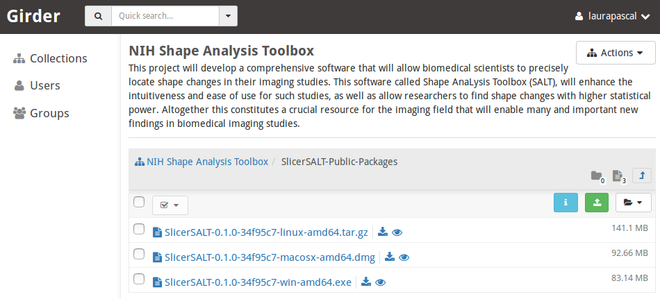
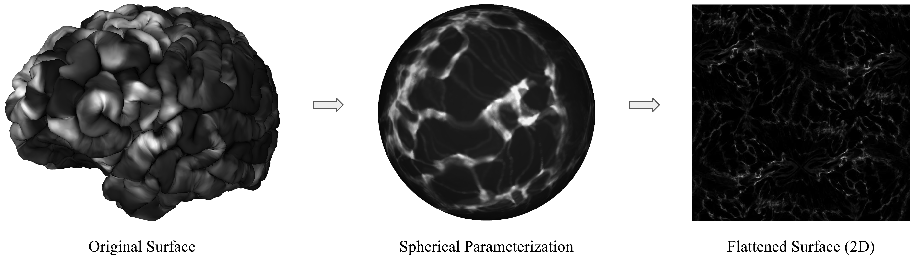

# Surface Mapping & Deep Learning Tutorial


## Authors
- Martin Styner, Beatriz Paniagua, Connor Bowley
- Mathieu Leclercq, Juan Carlos Prieto, Tom Bigonneau

---


## Overview

This tutorial combines two modules for surface-based analysis in 3D Slicer and SlicerSALT:

1. **SurfacePlaneMapper**: Flattens 3D surfaces (e.g., brain or hippocampus) into regular 2D images using geometry image techniques.
2. **SlicerSurfaceLearner**: Enables training of deep learning models (e.g., ResNet, EfficientNet) directly from the flattened images, without writing any code.


### Installation

You can install the module either via **SlicerSALT** or **3D Slicer**:

- **Using SlicerSALT**:  
  Download the application from [http://salt.slicer.org](http://salt.slicer.org), launch it, and the module will be ready to use.
  
  

- **Using 3D Slicer**:  
  Download 3D Slicer from [http://www.slicer.org](http://www.slicer.org). Open the **Extension Manager**, search for **SlicerSurfaceLearner**, click **Install**, and restart Slicer.


---

## 1. SurfacePlaneMapper

### Description

The **SurfacePlaneMapper** module flattens a 3D surface into a 2D image using the "Geometry Image" method by Gu et al. ([link](https://hhoppe.com/gim.pdf)):

- Cuts the surface into a disk using a predefined cut path network.
- Maps the boundary of this disk to a square.
- Geometry and feature data are stored in 2D grids with implicit correspondence.




### Module Parameters

- **Input Directory**  
  Choose the folder containing your surfaces, organized according to one of the supported directory structures explained below. This is where the module will look for your surface data.

- **File Type and Output Resolution**  
  Select the format of your input files (e.g., `.txt` or `.vtk`) and specify the desired resolution for the output images.  
  **Note:** The geometry image will initially occupy only one-quarter of the specified resolution. It will then be tiled 4 times to fill the full output image dimensions.

- **Sphere Template**  
  Choose the sphere template file used for mapping your surfaces. This file should be a `.vtk` or `.obj` file representing a subdivided icosahedral sphere.

- **Output Directory**  
  Select the folder where the results will be saved. The module will replicate your input folder structure and output flattened geometry images in both **PNG** (normalized) and **NIFTI** (raw) formats.


### Input Directory Structure

Two supported formats:

#### Option 1: `.txt` Feature Files

```
<input directory>
| ---- subject_id
       | ---- session
              | ---- modality
                     | ---- *.txt
```
Each `.txt` file contains features per surface point.

#### Option 2: `.vtk` Feature Files
```
<input directory>
| ---- subject_id
       | ---- session
              | ---- modality
                     | ---- *.vtk
```

### Sphere Template

A `.vtk` or `.obj` file representing a spherical icosahedral mesh (e.g., subdivision template).

### Output Directory Structure

```
<output directory>
| ---- subject_id
       | ---- session
              | ---- modality
                     | ---- .png (normalized for visualization) 
					 | ----.nii.gz (raw values for training)
```


Output look like :


---

## 2. SlicerSurfaceLearner

### Description

The **SlicerSurfaceLearner** module allows users to train deep learning models on the 2D images generated by SurfacePlaneMapper. No programming is required.

### Key Features

- Train image classification models without coding
- Select among ResNet, EfficientNet, CNNs, and more
- Supports checkpointing, cross-validation, loss selection, and hyperparameter tuning
- Usable through GUI or CLI

---


### How To Use

SlicerSurfaceLearner provides a graphical user interface that allows users to launch training sessions without needing to write scripts. Once your data is prepared in the expected format, you simply point to your dataset, choose a model from the available options, and click the "Start Trainer" button.

The module also supports advanced training options such as checkpointing, cross-validation, loss function selection, TensorBoard logging, and hyperparameter tuning. It can be used through the GUI or via command-line interface (CLI) for automation and flexibility.

To use the module, select a Data Directory as well as a CSV file containing your patients and their labels.

Click on "Load Training Data Directory" and choose your folder. The interface will automatically extract the features, session, and type from the structure.


Note: Your folder must follow the expected structure described below.

You will then need to manually enter the Group Name and ID Name.

Next, select the values you wish to use for training, choose the model, and click on "Start Trainer".

### Tips for Selecting Training Parameters

Here are some simple tips to help choose training parameters effectively:

- **Number of Epochs (Max Epochs)**  
  An epoch refers to one full pass through the entire training dataset.  
  Setting this number too high may lead to overfitting, where the model memorizes the data instead of learning general patterns.  
  A good starting point is usually between **10 and 100 epochs**.  
  Using **early stopping** is recommended—it automatically halts training when the model stops improving.

- **Learning Rate**  
  This controls how quickly the model updates its internal parameters.  
  If it's too high, the model might learn too fast and miss the optimal solution.  
  If it's too low, training will be slow and may get stuck.  
  A common starting value is **0.001**, but you may need to adjust it depending on your specific problem.

- **Batch Size**  
  This determines how many training examples the model processes before updating its parameters.  
  Smaller batch sizes (e.g., **16** or **32**) often lead to better generalization but slower training.  
  Larger batch sizes (e.g., **64** or **128**) can speed up training but require more memory.  
  If you're unsure, starting with a batch size of **32** is usually a safe choice.

- **Cross-Validation (e.g., K-Fold Cross-Validation)**  
  This technique helps ensure your model performs well not just on the training data, but also on unseen data.  
  It is especially useful when working with **smaller datasets**.  
  For **larger datasets**, it may be less critical.  
  If you're just starting out, you might skip it at first and consider adding it later for more robust evaluation.


#### Data Preparation

For the module to work, the user has to organize the data in the following manner:

(You can use png files but also NIFTI,such as provided by the PlaneMapper)


```
root_data_folder
| ---- subject_id
       | ---- time_stamp
              | ---- feature_name
                     | ---- <suffix_1>_<feature_name>_flat.png
                     | ---- <suffix_2>_<feature_name>_flat.png
```

For each subject, there can be data for multiple timestamps and multiple feature sets. The user can choose to train the model for a particular timestamp and a particular feature set.  


The `.jpeg` images are **2D representations**. The shape of the images must match across **hemisphere and population**.

The module will automatically detect the features, session, and type once the Training Data Directory is provided.

Additionally, when providing the CSV file, you must specify the column names for **Group Name** and **ID Name**, corresponding to the labels and identifiers, respectively.

---

### Output Directory Structure

The output of the training is saved in the **Output Directory** specified by the user. The folder structure is as follows:

```
<output directory>
| ---- log
       | ---- <model_name>
              | ---- fold_<k>
                     | ---- checkpoints
                     | ---- tensorboard
```

The **output directory** can contain outputs for **multiple runs** with different models. For example, the user can specify the same output directory but train different models such as **EfficientNet** or **SimpleCNN**.  

However, the path `<output directory>/log/<model_name>` **must be empty** before starting a new training session.  

For each model, the results for **multiple cross-validation folds** will be saved. The model checkpoints will be stored in the **"checkpoints"** directory, and TensorBoard logs will be saved in the **"tensorboard"** directory.

---

### Checkpoints

The trainer will save **n checkpoints**, where **n** is a user-defined number specified in the **Maximum Checkpoints** field under **Checkpointing**.  

These are the **n best checkpoints based on validation loss**.

---

### TensorBoard Logging

The user can monitor **loss/accuracy/AUC** during training using the **TensorBoard logs** stored in the `"tensorboard"` directory.

#### Steps to use TensorBoard:
1. Run the TensorBoard server using the command:  
   ```
   tensorboard --logdir <output directory>/log/<model_name>/fold_<k>/tensorboard --port <port_number>
   ```
2. Adjust the **TensorBoard port** in the UI and click **"Show Log"**.

This allows real-time monitoring of the training process.
For both training and validation, you will have access to : accuracy, precision, recall, and the loss per epoch and per step.


## Acknowledgements \- Resources \- Questions

<ul>
  <li> The SPHARM-PDM developers gratefully acknowledge funding for this project provided by NIH NIBIB R01EB021391 (Shape Analysis Toolbox for Medical Image Computing Projects), as well as the Slicer community.</li>
  <li>Github repository:</li>
      <ul>
            <li><a href="https://github.com/mturja-vf-ic-bd/SlicerSurfaceLearner">MFSDA</a></li>
            <li><a href="https://salt.slicer.org">SlicerSALT</a></li>
            <li><a href="https://github.com/Slicer/Slicer">3D Slicer</a></li>
      </ul>
  <li>Forums:</li>
      <ul>
            <li><a href="https://discourse.slicer.org/t/about-the-slicersalt-category/47">SlicerSALT</a></li>
            <li><a href="https://discourse.slicer.org/">3D Slicer</a></li>
      </ul>
  <li>Papers:</li>
      <ul>
            <li><a href="https://hhoppe.com/gim.pdf">Geometry Image Mapping</a></li>
      </ul>  
  <li>For other remarks or questions, please email: beatriz.paniagua@kitware.com</li>
</ul>

