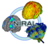
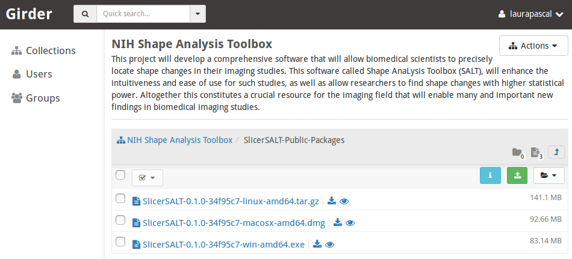
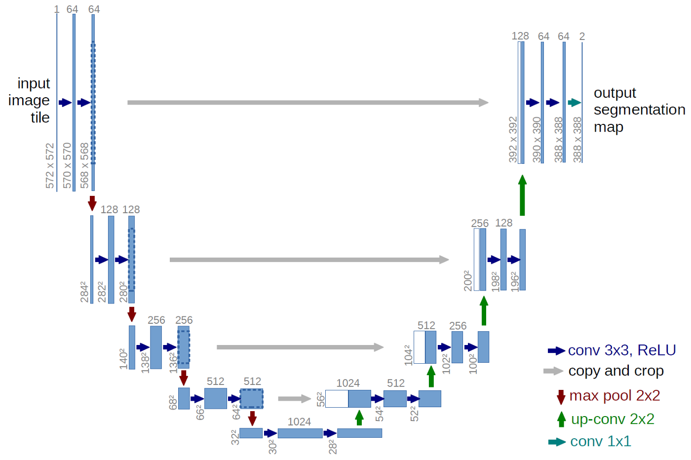
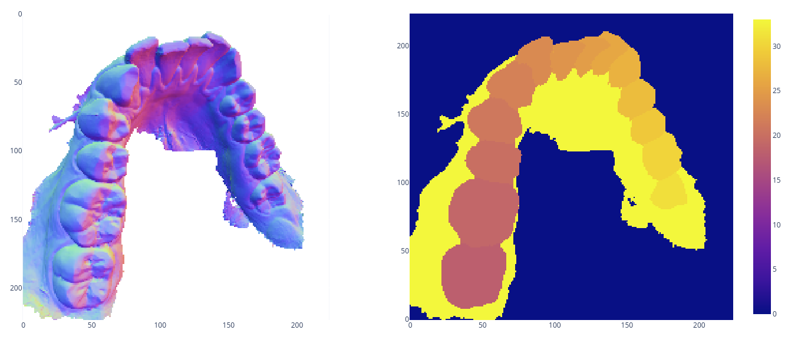

# SlicerSurfaceLearner User tutorial

Authors: Mathieu Leclercq\, Juan Carlos Prieto\, Martin Styner\, Connor Bowley\, Beatriz Paniagua \, Tom Bigonneau

Collaborators:




## SlicerSurfaceLearner

### SlicerSurfaceLearner Installation on SlicerSALT

Download the SlicerSALT packages for your respective operating system from the   _[SlicerSALT website ](http://salt.slicer.org)_  and install it\.   The module   will be ready to use then\. 


### SlicerSurfaceLearner Installation on 3D Slicer

 Download 3D Slicer packages for your respective operating system on the   _[3D Slicer website ](http://www.slicer.org)_  and install it\.



 In 3D Slicer\, open the Extension Manager




Search for    SlicerSurfaceLearner    in the    _Install Extensions_    tab\.

Click    _Install_   \.

Slicer needs to    restart    after installation\.


### Deep Learning Training Module

This module offers a user-friendly approach to training sophisticated deep learning models (e.g., ResNet, EfficientNet, CNN, etc.) without requiring any coding. By following a specific data format (explained later), users simply need to provide the input data directory, select a model from the available pool, and click the **"Start Trainer"** button. 

Advanced options are available for controlling different training aspects, including checkpointing, cross-validation, loss function, TensorBoard logging, and hyperparameter tuning. Moreover, the module can also be utilized via the **command-line interface (CLI)** instead of the graphical user interface (GUI).


### Key Features

- Training complex deep learning models for **2D images** without coding  
- Selection of popular **image classification networks** from a pre-defined pool  
- Advanced options for **checkpointing, cross-validation, loss function, and hyperparameter tuning**  
- **CLI usage** for enhanced flexibility and automation  

---

### How To Use





#### Data Preparation

For the module to work, the user has to organize the data in the following manner:

(You can use png files but also NIFTI,such as provided by the PlaneMapper)


```
root_data_folder
| ---- subject_id
       | ---- time_stamp
              | ---- feature_name
                     | ---- <suffix_1>_<feature_name>_flat.png
                     | ---- <suffix_2>_<feature_name>_flat.png
```

For each subject, there can be data for multiple timestamps and multiple feature sets. The user can choose to train the model for a particular timestamp and a particular feature set.  

For example, in the following case, each subject has features at **two time points**:  
- **6 months (V06)**  
- **12 months (V12)**  

For each of these time points, the subject has **three feature sets**:  
- **Cortical thickness (thickness)**  
- **Surface area (sa)**  
- **Local ea-csf (eacsf)**  

The `.jpeg` images are **2D representations**. The shape of the images must match across **hemisphere and population**.

The module will automatically detect the features, session, and type once the Training Data Directory is provided.

Additionally, when providing the CSV file, you must specify the column names for **Group Name** and **ID Name**, corresponding to the labels and identifiers, respectively.

---

### Output Directory Structure

The output of the training is saved in the **Output Directory** specified by the user. The folder structure is as follows:

```
<output directory>
| ---- log
       | ---- <model_name>
              | ---- fold_<k>
                     | ---- checkpoints
                     | ---- tensorboard
```

The **output directory** can contain outputs for **multiple runs** with different models. For example, the user can specify the same output directory but train different models such as **EfficientNet** or **SimpleCNN**.  

However, the path `<output directory>/log/<model_name>` **must be empty** before starting a new training session.  

For each model, the results for **multiple cross-validation folds** will be saved. The model checkpoints will be stored in the **"checkpoints"** directory, and TensorBoard logs will be saved in the **"tensorboard"** directory.

---

### Checkpoints

The trainer will save **n checkpoints**, where **n** is a user-defined number specified in the **Maximum Checkpoints** field under **Checkpointing**.  

These are the **n best checkpoints based on validation loss**.

---

### TensorBoard Logging

The user can monitor **loss/accuracy/AUC** during training using the **TensorBoard logs** stored in the `"tensorboard"` directory.

#### Steps to use TensorBoard:
1. Run the TensorBoard server using the command:  
   ```
   tensorboard --logdir <output directory>/log/<model_name>/fold_<k>/tensorboard --port <port_number>
   ```
2. Adjust the **TensorBoard port** in the UI and click **"Show Log"**.

This allows real-time monitoring of the training process.

---
## Acknowledgements \- Resources \- Questions

<ul>
  <li> The SPHARM-PDM developers gratefully acknowledge funding for this project provided by NIH NIBIB R01EB021391 (Shape Analysis Toolbox for Medical Image Computing Projects), as well as the Slicer community.</li>
  <li>Github repository:</li>
      <ul>
            <li><a href="https://github.com/NIRALUser/SPHARM-PDM">MFSDA</a></li>
            <li><a href="https://salt.slicer.org">SlicerSALT</a></li>
            <li><a href="https://github.com/Slicer/Slicer">3D Slicer</a></li>
      </ul>
  <li>Forums:</li>
      <ul>
            <li><a href="https://discourse.slicer.org/t/about-the-slicersalt-category/47">SlicerSALT</a></li>
            <li><a href="https://discourse.slicer.org/">3D Slicer</a></li>
      </ul>
  <li>Papers:</li>
      <ul>
            <li><a href="https://www.ncbi.nlm.nih.gov/pubmed/23606800">Lateral ventricle morphology analysis via mean latitude axis.</a></li>
            <li><a href="https://www.ncbi.nlm.nih.gov/pmc/articles/PMC3062073/">Framework for the Statistical Shape Analysis of Brain Structures using SPHARM\-PDM</a></li>
      </ul>  
  <li>For other remarks or questions, please email: beatriz.paniagua@kitware.com</li>
</ul>


